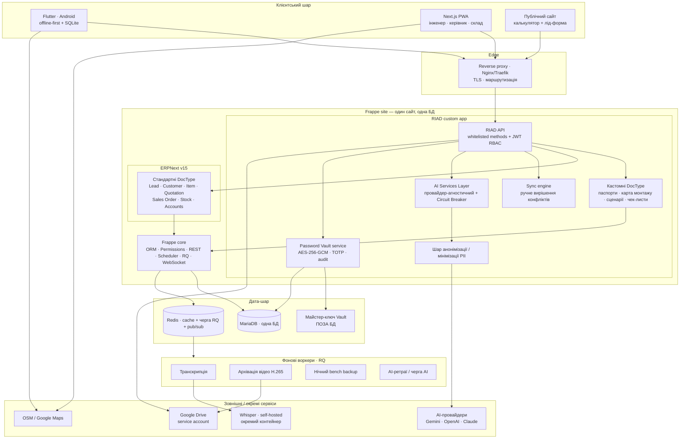
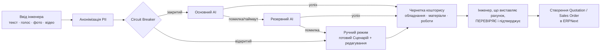
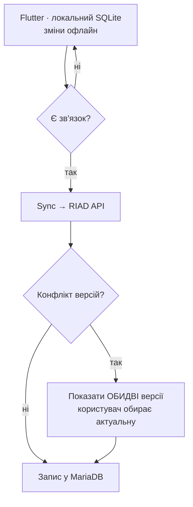

# RIAD Smart System — Фаза 1: Архітектура системи + стек технологій

> **Фаза:** 1 — Фундамент
> **База:** `RIAD_Smart_System_TZ_v2.md` + базові рішення з `DECISIONS.md`
> **Статус:** проєктування (код не пишемо)
> **Дата:** _(проставити при збереженні)_

---

## 0. Межі фази

Ця фаза фіксує **скелет**: які шари існують, з чого складаються, як між собою спілкуються, де живуть AI Services Layer, Password Vault і черга задач, та якими інструментами це будується. Деталі дата-моделі, конкретні DocType, ендпоінти й екрани — наступні фази. Тут — рамка, на яку вони ляжуть.

---

## 1. Архітектура — суть у двох реченнях

RIAD Smart System — це **не окрема система поруч з ERPNext, а надбудова всередині того самого Frappe-сайту**: один кастомний Frappe-додаток додає галузеві DocType, власний API з JWT-авторизацією, AI-шар, Vault і sync-двигун, працюючи на тій самій MariaDB і тій самій черзі Redis, що й ERPNext. Користувачі (Flutter / Next.js) ніколи не торкаються інтерфейсу ERPNext — вони звертаються до **RIAD API**, який під капотом читає й пише як кастомні, так і стандартні DocType ERPNext.

Ключовий наслідок для архітектури: **між RIAD і ERPNext немає мережевого «містка»** — це один процес, одна транзакційна межа, одна система прав Frappe. «Через API» в ТЗ означає *межу між фронтендом і бекендом*, а не HTTP-виклики між двома сервісами.

---

## 2. Діаграма: шари та компоненти

> **Ізоляція Vault від AI — це відсутність ребра.** На діаграмі навмисно немає жодної лінії між `VAULT` і `AISL`/`ANON`/`AIP`. Це не спрощення — це і є вимога: програмного шляху з Vault в AI-шар не існує на рівні коду.

---

## 3. Шари детально

### 3.1 Клієнтський шар
Три поверхні, одна логіка авторизації (JWT):
- **Flutter (Android, offline-first)** — польовий сценарій: виїзд, монтаж, чек-листи, фото/відео, точки монтажу. Працює без мережі, синхронізується відкладено.
- **Next.js PWA** — кабінет інженера/керівника/складу: аналітика, кошториси, паспорти, склад. Встановлюваний як застосунок, темна тема.
- **Публічний сайт + калькулятор** — лід-форма й AI-попередня пропозиція для клієнта. Без авторизації, мінімальні дані.

### 3.2 Edge: reverse proxy
Єдина точка входу (Nginx або Traefik): TLS-термінація (Let's Encrypt), маршрутизація на Frappe. Фронтенди **ніколи** не б'ються напряму в порт Frappe — лише через проксі.

### 3.3 Backend: Frappe site = ERPNext + RIAD custom app
Один сайт, один процес, одна БД. Усередині:
- **ERPNext v15** — джерело правди для Lead, Customer, Item, Quotation, Sales Order, Stock, Purchase, Accounts. Стандартні DocType не чіпаємо як схему — лише читаємо/пишемо через ORM.
- **RIAD custom app** — усе галузеве: кастомні DocType, RIAD API, AI-шар, Vault, sync-двигун, анонімізація.
- **Frappe core** надає «безкоштовно»: ORM, систему прав, REST, планувальник, чергу RQ, WebSocket (socketio). Це причина, чому окремих сервісів не потрібно.

**RIAD API** — це whitelisted-методи custom app. Фронтенд шле HTTPS-запит з JWT → метод перевіряє токен і права → працює через **Frappe ORM in-process** і з кастомними, і зі стандартними DocType. Жодного внутрішнього HTTP-хопу між «RIAD» і «ERPNext» немає.

**Зв'язок сутностей** — стандартний механізм Frappe **Link-полів**: кастомний `Object Passport` посилається на ERPNext `Customer`/`Lead`, кошторисний драфт — на `Quotation` тощо. Фінансові/складські дані не дублюються.

### 3.4 AI Services Layer
Python-модуль усередині custom app — **оркестрація**, не самі моделі:
- **Провайдер-агностичний інтерфейс** + адаптери (Gemini / OpenAI / Claude / інші). Додати провайдера = додати адаптер.
- **Ланцюг відмовостійкості**: основний → резервний → повний ручний режим (готовий Сценарій + ручне редагування).
- **Circuit Breaker** на кожен провайдер + **graceful degradation на рівні фічі** — недоступність AI не блокує CRUD.
- Перед будь-яким зовнішнім викликом обов'язково проходить **шар анонімізації** (3.4.1).
- Важкі/довгі задачі (транскрипція) не виконуються синхронно в запиті — ставляться в чергу RQ.

**3.4.1 Шар анонімізації / мінімізації PII.** Прибирає ПІБ, точну адресу, контакти, обличчя/документи на фото перед відправкою назовні. Зовнішній AI бачить тільки технічний опис («будинок 250 м², 8 камер, архів 30 днів»). Калькулятор на сайті оперує вже неперсональними даними, але ПІБ/контакти, якщо введені, в AI-запит не йдуть.

### 3.5 Password Vault — ізольований модуль
Окремий сервіс усередині custom app, але **відрізаний від AI**:
- Кастомний DocType, **поле-рівневе шифрування AES-256-GCM**.
- **Майстер-ключ — поза БД** (конфіг сервера), завантажується в застосунок; шов для майбутньої заміни на KMS/HashiCorp Vault без переписування бізнес-логіки.
- **TOTP MFA** на доступ (Google Authenticator/Authy, без SMS).
- **Повний аудит**: перегляд / зміна / експорт — хто, коли, що.
- **Жодного програмного шляху до AISL** — на рівні коду, не політики. Vault і його паспорти з обліковими даними ніколи не йдуть у Drive як файли.

### 3.6 Дата-шар
- **MariaDB** — одна база (ERPNext + усі кастомні DocType, включно з зашифрованими полями Vault). Нічний `bench backup` охоплює все одним проходом.
- **Redis** — кеш + черга RQ + pub/sub для realtime.
- **Майстер-ключ Vault** — поза БД, доступний лише Vault-сервісу.

### 3.7 Черга задач і фонові процеси (вбудована Frappe RQ + Redis)
Без окремого мікросервісу. Воркери:
- **Транскрипція** — викликає Whisper (3.8), кладе текст у завдання; при недоступності — статус «очікує транскрипції».
- **Архівація відео** — щомісячне перекодування старого відео в H.265.
- **Нічний бекап** — `bench backup` + копія на окреме сховище.
- **AI-черга / ретраї** — довгі AI-задачі та повторні спроби через Circuit Breaker.

### 3.8 Зовнішні / окремі сервіси
- **Whisper (self-hosted, окремий контейнер)** — розпізнавання мови локально, бо голос може містити PII і за ТЗ не йде у зовнішню хмару. Оркестрація — в AISL, але сам рушій поза Frappe-процесом (інший профіль навантаження, можливий GPU).
- **AI-провайдери** — лише через AISL, лише анонімізовані дані.
- **Google Drive (service account, доменне обмеження шерингу)** — медіафайли. Vault/паспорти з доступами — ніколи.
- **Maps (OSM/MapLibre основний, Google Maps опційно)** — карта об'єктів і точок монтажу на фронті.

---

## 4. Ключові потоки даних

### 4.1 Створення ліда + AI-аналіз ТЗ
`Flutter/Web/Калькулятор → RIAD API → створення Lead (ERPNext) + чернетки Object Passport → анонімізація → AISL (осн.→рез.→ручний) → первинна структура об'єкта → інженер редагує.` Vault не задіяний.

### 4.2 AI Project Builder → кошторис → ERPNext

**Жоден AI-кошторис не потрапляє в ERPNext без підтвердження інженером** — це жорстка межа потоку.

### 4.3 Голос → Whisper → PII-scrub → AI
`Запис голосу → збереження аудіо → RQ-задача → Whisper (self-hosted) → текст → очищення PII → AISL.` Якщо Whisper/AI недоступні — аудіо збережене, завдання «очікує обробки», інженер вводить текст вручну.

### 4.4 Offline-sync + конфлікти

Без «тихого» перезапису — лише ручний вибір користувача (за зразком Google Docs/Drive).

### 4.5 Доступ до Vault
`Користувач з правами → TOTP MFA → Vault-сервіс дешифрує поле майстер-ключем (з-поза БД) → запис в аудит → видача в UI.` Шляху в AI немає.

### 4.6 Файли
`Медіа → RIAD API → Google Drive (service account) → у DocType зберігається лише ID файлу Drive.` Vault і паспорти з доступами — поза Drive.

---

## 5. Важливі архітектурні рішення та уточнення

Усе це **операціоналізує ТЗ, не суперечить йому**. Де є реальна неоднозначність — винесено у відкриті питання (§8).

1. **In-process ORM замість HTTP між RIAD і ERPNext.** Оскільки custom app живе в тому ж сайті, «звернення до ERPNext» — це прямі виклики Frappe ORM, не мережа. Простіше, швидше, транзакційно безпечніше. «App token / Frappe API» з ТЗ трактуємо як межу *фронтенд ↔ бекенд*.
2. **Whisper — окремий контейнер, не код усередині Frappe.** Оркестрація STT — в AISL; сам рушій винесений (ресурси, можливий GPU, ізоляція). Це деталь розгортання, а не новий «зайвий сервіс» у сенсі ТЗ.
3. **1 RIAD-користувач = 1 Frappe User** з вимкненим доступом до desk UI — щоб права й аудит були гранулярні (а не спільний знеособлений акаунт). Тип User-а — відкрите питання (§8).
4. **Realtime** («Мої задачі сьогодні», статус AI) — через вбудований Frappe WebSocket + Redis pub/sub. Мобільний push (FCM) — у UX-фазу.
5. **Майстер-ключ** на старті — з конфіга поза БД, із чітким швом під KMS/HashiCorp Vault. Конкретний механізм — у фазу безпеки.
6. **Карти** — OSM/MapLibre як основний варіант (без білінгу), Google Maps — альтернатива.

---

## 6. Рекомендований стек технологій

| Шар | Технологія | Обґрунтування |
|---|---|---|
| ERP-бекенд | **ERPNext v15 + Frappe Framework v15 (Python)** | Мандат ТЗ. Уже розгорнуто. Дає ORM, права, REST, чергу, планувальник «з коробки». |
| Галузева логіка | **Власний Frappe custom app (Python)** | Один сайт, одна БД, нативний ORM, авто-REST на DocType, вбудована RBAC і черга — рівно вимога «без окремих СУБД і зайвих сервісів». |
| База даних | **MariaDB 10.6+** (версія під ERPNext v15) | Мандат: єдина БД, та сама, що в ERPNext. На масштабі 100–1000 лідів/міс достатньо реляційної БД. |
| Кеш / черга / realtime | **Redis** | Іде з Frappe: кеш + черга RQ + pub/sub для WebSocket. |
| Фонові задачі | **Frappe RQ workers** | Транскрипція, архівація, бекапи, AI-ретраї — без окремого мікросервісу. |
| AI-оркестрація | **Python провайдер-агностичний шар** (адаптери + Circuit Breaker, напр. `pybreaker`) | Ланцюг основний→резервний→ручний; додавання провайдера = новий адаптер. |
| AI-провайдери | **Gemini / OpenAI / Claude (конфігуровані)** | Мультипровайдерність за ТЗ. |
| STT (голос) | **Whisper, self-hosted** (`faster-whisper`/`whisper.cpp`), окремий контейнер | Конфіденційність: голос може містити PII, не йде в зовнішню хмару. |
| Анонімізація PII | **Python NER/правила** (кандидати: Presidio + spaCy, власні правила; покриття укр. — перевірити) | Обов'язковий шар перед зовнішнім AI. |
| Web-фронтенд | **Next.js + TypeScript, PWA** | Мандат. SSR/SSG для публічного сайту+калькулятора, встановлюваний PWA-кабінет, темна тема. |
| Web UI-стиль | **Tailwind CSS + headless-компоненти** (фіналізувати в UX-фазі) | Швидко зібрати «Monobank/Ajax»-вигляд без важкого ERP-UI. |
| Web data-layer | **TanStack Query + JWT** | Кеш запитів, робота зі статусами, авторизація. |
| Mobile | **Flutter (Dart), Android-пріоритет, offline-first** | Мандат. Один кодбейс, майбутній iOS. |
| Mobile локальна БД | **SQLite через Drift (або sqflite)** | Offline-first сховище. |
| Mobile секрети | **flutter_secure_storage** | Безпечне зберігання JWT/refresh на пристрої. |
| Авторизація | **JWT (PyJWT) RBAC**, мапінг на ролі Frappe | Власна модель ролей RIAD поверх прав Frappe. |
| MFA | **TOTP (`pyotp`)** | Для доступу до Vault, без SMS. |
| Шифрування Vault | **`cryptography` (AES-256-GCM)**, ключ поза БД | Поле-рівневе шифрування за ТЗ. |
| Файли | **Google Drive API (`google-api-python-client`), service account** | Доменне обмеження шерингу; без персональних OAuth. |
| Карти | **OpenStreetMap + MapLibre/Leaflet** (Google Maps опційно) | Без білінгу за замовчуванням. |
| Контейнеризація | **Docker / Docker Compose** (база `frappe_docker`) | Мандат: власний Linux-сервер у Docker. |
| Edge | **Nginx або Traefik** + Let's Encrypt | TLS, маршрутизація, єдина точка входу. |
| Середовища | **staging + production**, ручне підтвердження деплою | Мінімум 2 середовища за ТЗ. |
| Бекапи | **Нічний `bench backup`** + копія на окреме сховище | RPO ~24 год, RTO — години. |

---

## 7. Що НЕ входить у Фазу 1 (передано далі)

- Повний перелік і поля кастомних DocType, ER-діаграма, Link-зв'язки → **Фаза 2**.
- Конкретні ендпоінти RIAD API, контракти, деталі AI-адаптерів і анонімізації → **Фаза 3**.
- Карта екранів, UI-система, push-нотифікації → **Фаза 4**.
- План розробки, оцінка складності → **Фаза 5**.
- Ризики, масштабування, фінальний аудит → **Фаза 6**.
- Перед усім цим — **критичний аудит цієї архітектури → Фаза 1.5**.

---

## 8. Відкриті питання

1. **Тип Frappe User для польових ролей**: System User з обмеженим desk-доступом чи Website User? Впливає на модель прав і аудит. → Фаза 2 / безпека.
2. **Механізм зберігання майстер-ключа на старті**: env-змінна / файл зі строгими правами / docker secret / OS keyring? → фаза безпеки.
3. **Бібліотека анонімізації PII і покриття української мови** (Presidio+spaCy vs власні правила NER; розпізнавання облич/документів на фото). → Фаза 3.
4. **Захист публічного калькулятора** від абʼюзу (rate-limit / captcha) на безавторизаційному ендпоінті. → Фаза 3.
5. **UI-система для «Monobank/Ajax»-вигляду** (Tailwind+headless / Mantine / shadcn). → Фаза 4.
6. **Модель версіонування для sync-конфліктів**: updated-timestamp vs version vector; гранулярність — документ чи поле. → Фаза 2 / мобільна.
7. **Чи потрібен окремий легкий BFF** на боці Next.js — за замовчуванням ні (увесь API в Frappe custom app); перегляд при рості масштабу.
