# RIAD Smart System — Фаза 2: Дата-модель (сутності, DocType, ER-діаграма)

> **Фаза:** 2 — Дата-модель
> **База:** `RIAD_Smart_System_TZ_v2.md`, `DECISIONS.md` (вкл. Фазу 1.5 та резолюції власника), `01_architecture.md`, `015_architecture_audit.md`
> **Статус:** проєктування (код не пишемо)
> **Дата:** _(проставити при збереженні)_

---

## 0. Межі фази та що вона закриває

Ця фаза описує **дані**, а не код і не ендпоінти. Результат:

1. Розділення сутностей: **стандартні DocType ERPNext** (джерело правди) **окремо** від **кастомних DocType** RIAD custom app.
2. Для кожного кастомного DocType: призначення, ключові поля з типами Frappe, Link-поля на стандартні документи, child-таблиці, RBAC-зріз, field-level приховування.
3. Модель sync-метаданих (серверна версія, tombstones, UUID-name, адитивні колекції vs скалярні поля) — **закриває відкрите питання №6 Фази 1**.
4. Модель безпеки Vault: поле-рівневе шифрування, ізоляція, MFA-enrollment, tamper-evident аудит (hash-chain), потік «Акту передачі доступів» (H6).
5. ER-діаграма з Link-зв'язками; **Vault без жодного ребра до AI**.

**Зафіксовано у Фазі 1.5 (не переглядаємо, будуємо поверх):** Vault = кастомний DocType в одному app (Варіант A); ізоляція через CI-gate + роздільні воркери + ключ у людському web-контексті; Vault online-only; key-escrow — питання фази безпеки.

---

## 1. Принципи дата-моделі

Десять правил, на яких тримається вся модель нижче:

1. **Джерело правди не дублюється.** Фінанси, склад, серійні номери, ціни, контрагенти живуть у стандартних DocType ERPNext. Кастомні DocType **посилаються** на них через Link/Dynamic Link, а не копіюють.
2. **Кастомний DocType = галузева семантика**, якої немає в ERPNext: паспорт об'єкта, карта монтажу, сценарії, чек-листи, Vault, віддалені огляди, виїзди, акти.
3. **Доступ до стандартних DocType — лише через антикорупційний адаптер** (M3): жоден кастомний DocType не «знає» внутрішню схему `Quotation`/`Sales Order` напряму; усе йде через тонкий gateway-модуль. У дата-моделі це означає: Link-поля дозволені, але читання/запис полів стандартних документів інкапсульовано.
4. **Field-level приховування — нативними засобами Frappe** (permlevel на полі), не приховуванням в UI (H7). Закупівельна ціна/прибуток/маржа → `permlevel = 1`, доступ лише ролям, що мають read на рівні 1.
5. **Права ензфорсить Frappe permission engine** (H7). RIAD-роль = Frappe-роль. JWT лише резолвить у конкретного Frappe User; усі ORM-операції — в його контексті.
6. **Sync-метадані — це поля на самому DocType**, не окрема сутність (крім журналу конфліктів для UI). Серверна цілочисельна версія, tombstone, client-UUID як `name`.
7. **Адитивні колекції об'єднуються (union-merge), не «обираються»** (H3). Фото, відмітки чек-листа, серійники, точки монтажу — окремі записи з власним UUID; конфлікту немає за визначенням. Конфлікт можливий лише на **скалярних полях** (статус, нотатка) — вирішення на рівні поля.
8. **Vault — структурно осторонь.** Жоден кастомний DocType, пов'язаний з AI (Site Brief, AI Estimate, Scenario, AI Request Log), не має Link на Vault. Vault лінкується лише на Object Passport, Customer, власний аудит і enrollment.
9. **Мінімізація-first** (H1): те, що йде в зовнішній AI, — окрема **неперсональна** сутність (`Site Brief`), а не «почищений» паспорт. PII ніколи не матеріалізується в AI-орієнтованих сутностях.
10. **Vault-вмісне ніколи не стає файлом.** Клієнтська версія паспорта й Акт передачі доступів **генеруються on-demand**, не зберігають дешифровані секрети at-rest і не пишуться у Drive (H6).

---

## 2. Стандартні DocType ERPNext (джерело правди)

Ці DocType **не створюються і не модифікуються як схема**. RIAD читає/пише їх через адаптер. Перелік — ті, на які реально спираються кастомні сутності:

| DocType ERPNext | Роль у RIAD | Хто пише (через RIAD) |
|---|---|---|
| **Lead** | Початковий лід (CRM, калькулятор, ручне створення) | Інженер, публічний калькулятор |
| **Customer** | Клієнт після кваліфікації | Інженер |
| **Contact** / **Address** | Контакти й адреси клієнта (PII живе тут) | Інженер |
| **Item** | Каталог обладнання/матеріалів (вже завантажено) | Склад (через ERPNext) |
| **Item Price** | Закупівельні/роздрібні ціни | Склад / керівник |
| **Quotation** | Кошторис клієнту (КП) — створюється лише після перевірки інженером | Інженер (після підтвердження) |
| **Sales Order** | Підтверджене замовлення | Інженер / керівник |
| **Sales Invoice** | Рахунок (ФОП, UAH) | Керівник / інженер, що виставляє рахунок |
| **Payment Entry** | Вхідні платежі (майбутня звірка з Monobank API) | Керівник |
| **Delivery Note** | Видача обладнання на об'єкт | Склад |
| **Stock Entry** / **Stock Ledger** | Рух і залишки | Склад |
| **Serial No** | **Серійні номери — джерело правди** (склад + монтаж) | Склад, монтажник (скан) |
| **Batch** | Партії | Склад |
| **Warranty Claim** | Гарантійні звернення (фінансово-облікова частина) | Сервіс/керівник |
| **Purchase Order** / **Purchase Receipt** / **Purchase Invoice** | Закупівлі | Склад / керівник |
| **Supplier** | Постачальники | Склад |
| **Warehouse** | Склади | Склад |
| **User** / **Role** | **Єдине джерело прав** (H7); RIAD-ролі = Frappe-ролі | Адмін |

**Принцип зв'язку:** кастомний `Object Passport` → Link на `Customer`/`Lead`; `AI Estimate` при підтвердженні → створює `Quotation`; монтаж → пише в `Serial No`; сервіс → Link на `Warranty Claim`. Жодних дубльованих сум/залишків у кастомних DocType.

---

## 3. Кастомні DocType — карта за модулями ТЗ

Згруповано за модулями. Деталі кожного — у §4.

**CRM / вхід**
- `Site Brief` — неперсональний технічний опис об'єкта (вхід для AI, мінімізація-first)
- `Calculator Submission` — сабміт публічного калькулятора (без live-AI)

**Об'єкт і документація**
- `Object Passport` — паспорт об'єкта (внутрішня повна версія)
- `Passport Client Release` — реліз клієнтської версії (трекінг генерації, без даних Vault)
- `Installation Map` — карта монтажу (+ child: точки, кабельні маршрути)

**AI / кошторис / сценарії**
- `Scenario` — no-code шаблон конфігурації (+ child: позиції сценарію)
- `AI Estimate` — прорахунок/кошторис (+ child: позиції) — field-level приховування ціни/маржі
- `AI Provider` — конфіг провайдерів (no-code адмін)
- `AI Request Log` — лог AI-викликів (лише анонімізований payload — M10)

**Польові процеси (offline-first)**
- `Remote Inspection` — віддалений огляд
- `Engineer Visit` — виїзд інженера
- `Checklist Template` (+ child) / `Checklist Instance` (+ child) — чек-листи
- `Media Asset` — фото/відео/аудіо (Drive ID; адитивна колекція)

**Vault (ізольований)**
- `Vault Entry` — облікові дані за категоріями (AES-256-GCM пополе)
- `Vault Access Enrollment` — TOTP-секрет користувача (зашифрований)
- `Vault Audit Log` — tamper-evident hash-chain аудит
- `Access Transfer Act` — акт передачі доступів (H6, on-demand під MFA)

**Сервіс**
- `Service Request` — сервісна заявка/гарантійне звернення (+ child: дії/історія)

**Інфраструктура RIAD**
- `RIAD Device Session` — сесії/токени/девайси (JWT refresh, push-token під FCM пізніше)
- `RIAD Audit Log` — загальносистемний бізнес-аудит (доповнює нативний Frappe Version)
- `Sync Conflict` — журнал нерозв'язаних скалярних конфліктів для UI

---

## 4. Кастомні DocType — детально

Формат: **Призначення · Ключові поля (тип) · Link на стандартні · Child-таблиці · RBAC · Field-level · Sync-режим.**

Типи полів — стандартні Frappe: `Data, Link, Dynamic Link, Select, Int, Float, Currency, Check, Small Text, Text, Long Text, Date, Datetime, Geolocation, Attach, Table, Table MultiSelect, JSON`. Зашифровані Vault-поля — `Long Text` (base64 ciphertext+nonce+tag), **не** вбудований Frappe `Password` (його ключ у `site_config`, що суперечить вимозі «ключ окремо»).

---

### 4.1 `Site Brief` — неперсональний опис об'єкта (вхід AI)

**Призначення.** Структурований **неперсональний** опис, що єдиний легально йде в зовнішній AI (мінімізація-first, H1). PII сюди не потрапляє за визначенням.

**Ключові поля:** `object_type (Select: квартира/будинок/офіс/склад/територія)`, `area_m2 (Float)`, `cameras_count (Int)`, `camera_type (Select: IP/аналог/змішано)`, `archive_days (Int)`, `access_control (Check)`, `intercom (Check)`, `alarm (Check)`, `network_needed (Check)`, `power_backup (Check)`, `tech_notes (Small Text — лише технічне, без імен/адрес)`, `source (Select: калькулятор/інженер/огляд)`.

**Link на стандартні:** `lead (Link → Lead)` — опційно; **без** контактів/адреси.

**Child:** немає.

**RBAC:** керівник R, інженер RW, монтажник —, склад —.

**Field-level:** —.

**Sync:** online (створюється в кабінеті/калькуляторі).

> **Чому окремо від паспорта:** «те, що ніколи не покидає периметр, не треба чистити». Паспорт містить PII; Site Brief — ні. У AI йде Site Brief, не паспорт.

---

### 4.2 `Calculator Submission` — сабміт публічного калькулятора

**Призначення.** Захоплення ліда з сайту. **Без live зовнішнього AI** (H5): попередня оцінка — детермінований розрахунок зі `Scenario`.

**Ключові поля:** `object_type (Select)`, `area_m2 (Float)`, `cameras_count (Int)`, `archive_days (Int)`, `contact_name (Data)`, `contact_phone (Data)`, `contact_email (Data)`, `estimated_total (Currency — з детермінованого шаблону)`, `matched_scenario (Link → Scenario)`, `status (Select: новий/оброблено/спам)`, `source_ip (Data)`, `captcha_passed (Check)`.

**Link на стандартні:** `lead (Link → Lead)` — створюється після кваліфікації.

**Child:** немає.

**RBAC:** керівник R, інженер RW, монтажник —, склад —. Створення — анонімний публічний ендпоінт (rate-limit + captcha).

**Field-level:** `source_ip` — `permlevel 1` (лише керівник/інженер).

**Sync:** online.

> **Розв'язання:** контакти тут зберігаються (потрібні для дзвінка), але **в AI-запит не йдуть**; для оцінки використовується лише `object_type/area/cameras/archive` через Scenario.

---

### 4.3 `Object Passport` — паспорт об'єкта (внутрішня версія)

**Призначення.** Центральна галузева сутність — повний паспорт об'єкта (внутрішня версія). Парасоля життєвого циклу: лід → проєкт → монтаж → сервіс.

**Ключові поля:** `object_title (Data)`, `status (Select: лід/проєктування/змонтовано/сервіс/архів)`, `object_type (Select)`, `area_m2 (Float)`, `geo (Geolocation)`, `service_contact_name (Data)`, `service_contact_phone (Data)`, `warranty_summary (Small Text)`, `internal_notes (Text)`.

**Link на стандартні:** `customer (Link → Customer)`, `lead (Link → Lead)`, `primary_address (Link → Address)`. **Без** дублювання фінансів.

**Зв'язки на кастомні (зворотні/Link):** `installation_map (Link → Installation Map)`, `site_brief (Link → Site Brief)`. Vault, виїзди, огляди, сервіси, медіа посилаються **на** паспорт (зворотні Link).

**Child:** `installed_equipment` (child `Object Equipment`): рядки `serial_no (Link → Serial No)`, `item (Link → Item)`, `category (Select)`, `mount_point_ref (Data — UUID точки)`, `installed_on (Date)`. Серійники — посилання на ERPNext `Serial No`, не копія.

**RBAC:** керівник R, інженер RW, монтажник R (лише свої об'єкти — через User Permission на `customer`/призначення), склад R.

**Field-level:** `internal_notes`, `warranty_summary` — `permlevel 0` для інженера/керівника; монтажник бачить лише операційне.

**Sync:** переважно online (керується в кабінеті); польові зміни вносяться через `Engineer Visit`/`Media`, не прямим офлайн-редагуванням паспорта.

---

### 4.4 `Passport Client Release` — клієнтська версія паспорта

**Призначення.** Трекінг **генерації** клієнтської версії. Сама клієнтська версія — **згенерований рендер** (Print Format/PDF on-demand), що виключає будь-які облікові дані; **окремий DocType з дубльованими даними не створюємо** (принцип «без дублювання»).

**Ключові поля:** `passport (Link → Object Passport)`, `generated_by (Link → User)`, `generated_at (Datetime)`, `delivery_method (Select: захищене посилання/друк/PDF)`, `delivered_at (Datetime)`, `excludes_credentials (Check — завжди true, read-only)`, `release_hash (Data — хеш виданого вмісту для трекінгу версій)`.

**Link на стандартні:** `customer (Link → Customer)`.

**Child:** немає.

**RBAC:** керівник RW, інженер RW, монтажник —, склад —.

**Field-level:** —.

**Sync:** online.

> **Розв'язання розвилки «внутрішня + клієнтська версія»:** внутрішня = `Object Passport` (DocType), клієнтська = детермінований рендер з нього **без** Vault-полів, трекається цим легким релізом. Облікові дані клієнту передаються **тільки** через `Access Transfer Act` (§4.18), не через паспорт.

---

### 4.5 `Installation Map` — карта монтажу

**Призначення.** Інтерактивна карта об'єкта: точки камер/Wi-Fi/СКУД/датчиків, кабельні маршрути. Зміни затверджує інженер.

**Ключові поля:** `passport (Link → Object Passport)`, `base_plan_media (Link → Media Asset — план/підкладка)`, `map_kind (Select: план приміщення/територія/гібрид)`, `approved_by (Link → User)`, `approved_at (Datetime)`.

**Child:**
- `mount_points` (child `Mount Point`): `point_uuid (Data — клієнтський UUID, ключ union-merge)`, `type (Select: камера/wifi/скуд/домофон/датчик/реєстратор)`, `label (Data)`, `geo (Geolocation)` або `x/y (Float)`, `item (Link → Item)`, `serial_no (Link → Serial No)`, `status (Select: заплановано/змонтовано)`, `photo (Link → Media Asset)`, `note (Small Text)`.
- `cable_routes` (child `Cable Route`): `route_uuid (Data)`, `from_point (Data — point_uuid)`, `to_point (Data)`, `cable_type (Link → Item)`, `length_m (Float)`, `path (JSON — масив координат)`.

**Link на стандартні:** через child — `Item`, `Serial No`.

**RBAC:** керівник R, інженер RW, монтажник RW (точки/статуси/фото свого об'єкта; **затвердження карти — лише інженер** через окреме право на `approved_by`).

**Field-level:** —.

**Sync:** **offline-first.** `mount_points` і `cable_routes` — **адитивні колекції**: union-merge за `point_uuid`/`route_uuid`, без pick-one. Скалярні поля карти (`map_kind`, `approved_*`) — field-level конфлікт.

---

### 4.6 `Scenario` — no-code шаблон конфігурації

**Призначення.** Шаблон типової конфігурації («4 аналогові камери», «8 IP камер»). Подвійна роль: основа для AI **та** повний ручний fallback (рівень 3 відмовостійкості). Редагується **через форму Frappe** — no-code (ТЗ).

**Ключові поля:** `scenario_name (Data)`, `category (Select: аналог/IP/СКУД/домофон/сигналізація/мережа/сервер)`, `description (Small Text)`, `is_active (Check)`.

**Child:** `scenario_items` (child `Scenario Item`): `item (Link → Item)`, `default_qty (Float)`, `qty_rule (Select: фіксовано/на камеру/на 100м²/на точку)`, `qty_factor (Float)`, `required (Check)`, `note (Small Text)`.

**Link на стандартні:** `Item` (у child).

**RBAC:** керівник RW, інженер R (застосовує), **no-code адмін** (окрема роль `RIAD Scenario Admin`) RW, монтажник —, склад —.

**Field-level:** —.

**Sync:** online.

> **No-code:** адміністратор додає/редагує позиції списком у стандартній Frappe-формі дочірньої таблиці; жодних конфіг-файлів чи скриптів. `qty_rule` дає просту параметризацію без коду.

---

### 4.7 `AI Estimate` — прорахунок / кошторис

**Призначення.** Результат AI Project Builder **до** перетворення на `Quotation`. Тут — позиції з ціною/маржею. **Жоден AI-кошторис не йде в ERPNext без перевірки інженером** (жорстка межа потоку).

**Ключові поля:** `passport (Link → Object Passport)`, `site_brief (Link → Site Brief)`, `status (Select: чернетка/на перевірці/підтверджено/відхилено)`, `origin (Select: AI-основний/AI-резервний/ручний-сценарій)`, `variant (Select: дешевий/оптимальний/преміум)`, `source_scenario (Link → Scenario — якщо ручний/деградація)`, `reviewed_by (Link → User)`, `reviewed_at (Datetime)`, `total_retail (Currency)`, `total_cost (Currency, permlevel 1)`, `total_margin (Currency, permlevel 1)`.

**Child:** `estimate_lines` (child `AI Estimate Line`):
- `item (Link → Item)`, `description (Small Text)`, `qty (Float)`, `uom (Link → UOM)`
- `retail_rate (Currency)` — видно інженеру/керівнику
- `purchase_rate (Currency, permlevel 1)` — **приховано від монтажника**
- `profit (Currency, permlevel 1)`, `margin_pct (Percent, permlevel 1)`
- `line_source (Select: AI/сценарій/ручне)`

**Link на стандартні:** `Item`, `UOM`; при підтвердженні → створює `Quotation` (`quotation (Link → Quotation)`), далі `Sales Order`. Створення — **через антикорупційний адаптер** (M3).

**RBAC:** керівник RW(+permlevel 1 R), інженер RW(+permlevel 1 R — інженер, що виставляє рахунок, бачить маржу), монтажник —, склад —.

**Field-level (H7):** `purchase_rate`, `profit`, `margin_pct`, `total_cost`, `total_margin` → `permlevel 1`; read на рівні 1 — лише керівник та інженер. Монтажник доступу до DocType не має взагалі, але permlevel — другий рубіж.

**Sync:** online (потребує цін/AI).

---

### 4.8 `AI Provider` — конфіг провайдерів (no-code)

**Призначення.** Провайдер-агностичний шар: реєстр провайдерів і порядок failover. No-code адмін.

**Ключові поля:** `provider_name (Data)`, `provider_type (Select: Gemini/OpenAI/Claude/інший)`, `priority (Int — порядок у ланцюзі)`, `is_enabled (Check)`, `endpoint (Data)`, `model (Data)`, `health_status (Select: healthy/degraded/down — оновлюється рантаймом)`, `last_check (Datetime)`. **Ключі API — не тут**, а в конфізі сервера/секретах (як і майстер-ключ Vault — поза БД).

**Child:** немає.

**RBAC:** керівник R, `RIAD AI Admin` RW, інші —.

**Field-level:** —.

**Sync:** online. Стан Circuit Breaker — у **Redis** (спільний між воркерами, M9), не в цьому DocType; тут лише конфіг і кешований health.

---

### 4.9 `AI Request Log` — лог AI-викликів

**Призначення.** Аудит/вартість/дебаг AI. **Лише анонімізований payload** (M10), ніколи сирий PII, ніколи Vault.

**Ключові поля:** `timestamp (Datetime)`, `feature (Select: project_builder/inspection_report/calculator/transcription)`, `provider_used (Link → AI Provider)`, `fallback_chain (Small Text — який ланцюг спрацював)`, `anonymized_payload (Long Text — лише знеособлене)`, `result_status (Select: успіх/помилка/таймаут/деградація)`, `latency_ms (Int)`, `tokens (Int)`, `breaker_state (Select)`.

**Link на стандартні:** немає. **Link на Vault — заборонено** (структурно).

**RBAC:** керівник R, AI Admin R, інші —.

**Field-level:** —.

**Sync:** online (серверний).

---

### 4.10 `Remote Inspection` — віддалений огляд

**Призначення.** Відеозв'язок, фотофіксація, голосові нотатки, транскрипція; AI формує структурований звіт. При недоступності AI — «очікує обробки», ручний ввід тексту.

**Ключові поля:** `passport (Link → Object Passport)`, `lead (Link → Lead)`, `engineer (Link → User)`, `date (Datetime)`, `ai_report (Text)`, `manual_report (Text)`, `status (Select: чернетка/очікує_AI/готово/ручний)`, `transcription_status (Select: немає/очікує/готово/ручний)`.

**Child:** `inspection_media` (child) — рядки `media (Link → Media Asset)`, `kind (Select: фото/відео/аудіо)`. (Медіа — адитивна колекція.)

**Link на стандартні:** `Lead`.

**RBAC:** керівник R, інженер RW, монтажник R (свої), склад —.

**Field-level:** —.

**Sync:** медіа — offline-first (через `Media Asset`); звіт — переважно online.

---

### 4.11 `Engineer Visit` — виїзд інженера (offline-first ядро)

**Призначення.** Польовий режим: фото/відео, голосові нотатки, чек-листи, точки монтажу, нотатки — повністю офлайн з відкладеною синхронізацією.

**Ключові поля:** `name (= client UUID)`, `passport (Link → Object Passport)`, `engineer (Link → User)`, `visit_type (Select: огляд/монтаж/сервіс/демонтаж)`, `started_at (Datetime)`, `finished_at (Datetime)`, `summary (Small Text — скаляр, можливий конфлікт)`, `status (Select: чернетка/в_роботі/завершено)`.

**Child:**
- `visit_media` (адитивна): `media (Link → Media Asset)` — union-merge.
- `visit_serials` (адитивна): `serial_no (Link → Serial No)`, `item (Link → Item)`, `scanned_at (Datetime)`, `scan_uuid (Data)` — union-merge; пише в ERPNext `Serial No` через адаптер.

**Link на стандартні:** `Serial No`, `Item`.

**RBAC:** керівник R, інженер RW, монтажник RW (свої виїзди), склад R (серійники).

**Field-level:** —.

**Sync:** **offline-first.** `name` = клієнтський UUID (ідемпотентність). Адитивні child — union-merge. Скаляри (`summary`, `status`, `finished_at`) — field-level конфлікт → `Sync Conflict`.

---

### 4.12 `Checklist Template` (+child) — шаблон чек-листа

**Призначення.** No-code шаблон чек-листів обладнання/матеріалів/робіт.

**Ключові поля:** `template_name (Data)`, `type (Select: монтаж/сервіс/огляд)`, `category (Select)`, `is_active (Check)`.

**Child:** `template_items` (child `Checklist Template Item`): `seq (Int)`, `text (Small Text)`, `requires_photo (Check)`, `requires_serial (Check)`, `requires_value (Check)`, `value_label (Data)`.

**RBAC:** керівник RW, `RIAD Scenario Admin` RW, інженер R, монтажник R.

**Sync:** online.

---

### 4.13 `Checklist Instance` (+child) — екземпляр чек-листа

**Призначення.** Заповнюваний чек-лист конкретного виїзду/монтажу.

**Ключові поля:** `name (= client UUID)`, `template (Link → Checklist Template)`, `visit (Link → Engineer Visit)`, `passport (Link → Object Passport)`, `status (Select: відкрито/завершено)`.

**Child:** `instance_items` (child `Checklist Instance Item`, **адитивна за `item_uuid`**): `item_uuid (Data)`, `template_item_ref (Data)`, `checked (Check)`, `checked_by (Link → User)`, `checked_at (Datetime)`, `photo (Link → Media Asset)`, `value (Data)`, `serial_no (Link → Serial No)`.

**Link на стандартні:** `Serial No`.

**RBAC:** керівник R, інженер RW, монтажник RW (свої), склад R.

**Sync:** **offline-first.** Відмітки — union-merge (двоє монтажників відмічають різні пункти → об'єднання, не втрата). Скаляр `status` — field-level.

---

### 4.14 `Media Asset` — фото/відео/аудіо

**Призначення.** Єдина адитивна колекція медіа. Файл — у Google Drive (service account); у DocType — лише ID файлу.

**Ключові поля:** `name (= client UUID)`, `drive_file_id (Data)`, `media_type (Select: фото/відео/аудіо)`, `tag (Select: до/після/СММ/огляд/план)`, `parent_doctype (Link → DocType)`, `parent_name (Dynamic Link)`, `captured_at (Datetime)`, `captured_by (Link → User)`, `transcription (Long Text — для аудіо)`, `transcription_status (Select: немає/очікує/готово/ручний)`, `riad_deleted (Check)`.

**Link на стандартні:** немає (через Dynamic Link на будь-який parent).

**RBAC:** керівник R, інженер RW, монтажник RW (свої), склад R.

**Field-level:** —.

**Sync:** **offline-first, чисто адитивна.** Власний UUID-`name` → ідемпотентний ретрай. Видалення — tombstone (`riad_deleted`), не hard-delete. **Сирі фото за замовчуванням не йдуть у зовнішній AI** (H2): прапорець `ai_allowed (Check, default 0)`.

> **Аудіо → транскрипція:** аудіо зберігається; RQ-задача → self-hosted Whisper → текст у `transcription`. При недоступності — `transcription_status = очікує`, інженер вводить вручну.

---

### 4.15 `Vault Entry` — облікові дані (ізольований модуль)

**Призначення.** Критичний модуль: логіни/паролі/IP/домени/DDNS/серійники за категоріями. **AES-256-GCM пополе, ключ поза БД, online-only, ізольовано від AI.**

**Ключові поля:**
- `passport (Link → Object Passport)`, `customer (Link → Customer)`
- `category (Select: камера/реєстратор/маршрутизатор/wifi/сервер/СКУД/домофон/сигналізація)`
- `label (Data — неконфіденційна мітка)`
- `serial_no (Link → Serial No — опційно)`
- **Зашифровані поля (`Long Text`, ciphertext+nonce+tag, base64):** `login_enc`, `password_enc`, `ip_enc`, `domain_enc`, `ddns_enc`, `serial_enc`, `notes_enc`

**Link на стандартні:** `Customer`, `Serial No`. **Link на AI-сутності — структурно заборонено** (CI import-linter gate).

**Child:** немає.

**RBAC:** керівник R(+MFA), інженер R/W(+MFA), монтажник — за замовчуванням; винятково — read конкретних позицій свого активного наряду online під MFA (H4), **без офлайн-кешу**; склад —.

**Field-level:** усі `*_enc` — `permlevel 1`; дешифрування — **лише сервіс Vault** під MFA-валідованою людською web-сесією. Фонові/AI/RQ-воркери не мають ключ-контексту → не можуть дешифрувати навіть при виклику.

**Sync:** **online-only.** Ніколи не кешується в локальний SQLite (зафіксовано Фазою 1.5). Виняток (майбутнє): шифрований TTL-кеш у `flutter_secure_storage` з remote-wipe.

> **Шов під майбутнє (DECISIONS):** `*_enc` + зовнішній ключ ізолюють крипто-шар; перенесення дешифрування за процесну межу (виділений Vault-процес / KMS) не змінює цю модель полів — лише реалізацію сервісу.

---

### 4.16 `Vault Access Enrollment` — TOTP-секрет користувача

**Призначення.** Зберігання TOTP-секрету для MFA-доступу до Vault. Сам секрет — теж чутливий → шифрований.

**Ключові поля:** `user (Link → User)`, `totp_secret_enc (Long Text — зашифровано тим самим зовнішнім ключем)`, `enrolled_at (Datetime)`, `last_used_at (Datetime)`, `is_active (Check)`.

**RBAC:** користувач — лише власний enrollment (self); адмін безпеки — керування активацією, **без читання секрету**. Дешифрування — лише сервіс Vault при верифікації коду.

**Sync:** online-only, ізольовано.

---

### 4.17 `Vault Audit Log` — tamper-evident аудит (hash-chain)

**Призначення.** Незмінний журнал доступу до Vault: перегляд/створення/зміна/експорт/генерація акту — хто, коли, що (M5).

**Ключові поля:**
- `seq (Int, autoincrement — глобальний монотонний порядок)`
- `timestamp (Datetime)`, `user (Link → User)`, `session_id (Data)`, `ip (Data)`
- `action (Select: view/create/update/export/act_generate/mfa_fail)`
- `vault_entry (Link → Vault Entry)`, `passport (Link → Object Passport)`
- `field_touched (Data — яке поле дешифровано/змінено)`
- `prev_hash (Data)`, `record_hash (Data — SHA-256 від (seq|timestamp|user|action|vault_entry|field|prev_hash))`

**Tamper-evidence:** **єдиний глобальний hash-chain** — кожен запис містить хеш попереднього; будь-яка зміна «у середині» рве ланцюг. Опційно — періодичне відвантаження в зовнішнє append-only сховище (друга лінія). Append-only: DocType **без** update/delete-прав ні в кого, лише insert сервісом Vault.

**RBAC:** керівник R, інженер — лише власні дії (опційно), адмін безпеки R. **Ніхто** не має write/delete у UI.

**Sync:** online-only, серверний.

> **Розв'язання гранулярності:** обрано **єдиний глобальний ланцюг** (а не per-entry/per-day) — простіша верифікація цілісності й сильніша гарантія; контеншн на запис прийнятний на масштабі ТЗ (Vault-доступи рідкі). Per-shard — майбутня оптимізація, якщо знадобиться.

---

### 4.18 `Access Transfer Act` — акт передачі доступів (H6)

**Призначення.** Документ передачі клієнту логінів/паролів/гарантій. **Єдиний легальний код-шлях, що читає дешифрований Vault і матеріалізує його в документ** — тому максимально обмежений.

**Ключові поля:** `passport (Link → Object Passport)`, `customer (Link → Customer)`, `generated_by (Link → User)`, `generated_at (Datetime)`, `delivery_method (Select: одноразове_посилання_TTL/друк/захищений_PDF)`, `delivered_at (Datetime)`, `client_acknowledged (Check)`, `acknowledged_at (Datetime)`, `acknowledgement_ref (Data — підпис/посилання)`, `audit_ref (Link → Vault Audit Log)`.

**Child:** `included_entries` (child): `vault_entry (Link → Vault Entry)` — **лише посилання**, не дешифровані значення.

**Критичні правила (H6):**
- Генерація — **on-demand під MFA-сесією з правами**, з обов'язковим записом у `Vault Audit Log` (`action = act_generate`).
- Дешифровані облікові дані **матеріалізуються лише в момент доставки**, в пам'яті, **ніколи не зберігаються at-rest** у цьому DocType.
- Документ **ніколи не пишеться у Google Drive**; доставка — захищеним каналом (одноразове посилання з TTL / друк / захищений PDF), не email-вкладенням.

**RBAC:** керівник RW(+MFA), інженер RW(+MFA), монтажник —, склад —.

**Sync:** online-only.

---

### 4.19 `Service Request` — сервісне обслуговування

**Призначення.** Гарантійні звернення, сервісні заявки, історія ремонтів/виїздів/замін обладнання/змін паролів.

**Ключові поля:** `passport (Link → Object Passport)`, `customer (Link → Customer)`, `request_type (Select: гарантія/платний_сервіс/планове)`, `description (Text)`, `status (Select: новий/в_роботі/очікує_деталі/закрито)`, `assigned_to (Link → User)`, `opened_at (Datetime)`, `closed_at (Datetime)`.

**Child:** `service_actions` (child `Service Action`): `action_date (Datetime)`, `performed_by (Link → User)`, `action_type (Select: діагностика/ремонт/заміна/зміна_паролів)`, `replaced_serial_old (Link → Serial No)`, `replaced_serial_new (Link → Serial No)`, `note (Small Text)`, `vault_audit_ref (Link → Vault Audit Log — якщо змінювалися доступи)`.

**Link на стандартні:** `Warranty Claim (Link)` — коли звернення гарантійне (фінансово-облікова частина живе в ERPNext); `Serial No`.

**RBAC:** керівник R, інженер RW, монтажник RW (призначені, без фінансів), склад R (заміни/серійники).

**Sync:** польові дії — offline-first (через виїзд/медіа); заявка — online.

> **«Історія змін паролів»** не дублюється тут — вона **є** у `Vault Audit Log`; `Service Action` лише посилається (`vault_audit_ref`). Жодного дешифрованого вмісту.

---

### 4.20 Інфраструктурні DocType RIAD

**`RIAD Device Session`** — `user (Link → User)`, `device_id (Data)`, `platform (Select: android/web/ios)`, `jwt_jti (Data)`, `refresh_token_hash (Data)`, `issued_at`, `expires_at`, `revoked (Check)`, `push_token (Data — FCM, майбутнє)`. RBAC: користувач — власні; адмін — усі. Online.

**`RIAD Audit Log`** — загальносистемний бізнес-аудит понад нативний Frappe `Version`/`Activity Log`: `timestamp`, `user`, `doctype`, `docname`, `event (Select)`, `summary`. Для Vault — **не використовується** (там окремий hash-chain). RBAC: керівник/адмін R.

**`Sync Conflict`** — журнал нерозв'язаних **скалярних** конфліктів для UI: `doctype`, `docname`, `field`, `server_value`, `client_value`, `server_version`, `client_base_version`, `device_id`, `resolved (Check)`, `chosen (Select: server/client)`, `resolved_by`. RBAC: власник документа RW. Online (створюється при push).

---

## 5. Sync-метадані — модель (закриває відкрите питання №6)

Метадані живуть **на самих syncable DocType** як поля (не окрема сутність). Syncable: `Engineer Visit`, `Checklist Instance`, `Media Asset`, `Installation Map` (+ child-точки), частково `Remote Inspection` (медіа). **Не syncable (online-only):** усе Vault, `AI Estimate`, фінанси.

**Поля на кожному syncable DocType:**

| Поле | Тип | Призначення |
|---|---|---|
| `name` | Data (= client UUID) | **Ідемпотентність** (H3): ретрай флапнутого push не створює дубль. Autoname `field:client_uuid`. |
| `riad_version` | Int | **Серверна монотонна версія**, +1 на кожен серверний запис. Джерело істини версії — сервер, не timestamp пристрою. |
| `riad_deleted` | Check | **Tombstone**: видалення поширюється синхронізацією; «воскресіння» неможливе. |
| `riad_deleted_at` | Datetime | Час видалення. |
| `riad_origin_device` | Data | Який пристрій створив. |
| `riad_synced_at` | Datetime | Останній успішний sync. |

**Запит на push несе `client_base_version`** (версію, з якої клієнт почав офлайн). Сервер порівнює з `riad_version`:

- **Адитивні колекції** (child-рядки з власним UUID: фото, відмітки, серійники, точки монтажу): **union-merge за UUID** — конфлікту немає; рядки лише додаються/тумбстоняться. Двоє монтажників на одному об'єкті → об'єднання, не втрата (H3).
- **Скалярні поля** (`status`, `summary`, `note`, `finished_at`): конфлікт **лише при реальному розходженні** (`client_base_version < riad_version` і поле змінене обома) → створюється `Sync Conflict`, **обидві версії показуються**, користувач обирає (à la Google Docs). Без тихого перезапису.
- **Document-level pick-one** — лише останній резерв, коли поле-рівневе об'єднання неможливе.

**Часові мітки пристроїв не використовуються для вирішення** (розбіжність годинників — H3); рішення — за серверною версією.

---

## 6. ER-діаграма

Кастомні DocType + Link на стандартні ERPNext. **Vault-кластер не має жодного ребра до AI-кластера** (Site Brief / AI Estimate / Scenario / AI Provider / AI Request Log). Фінанси/склад не дублюються — лише Link.

```mermaid
erDiagram
    %% ===== Стандартні ERPNext (джерело правди) =====
    LEAD["Lead (ERPNext)"]
    CUSTOMER["Customer (ERPNext)"]
    ADDRESS["Address (ERPNext)"]
    ITEM["Item (ERPNext)"]
    SERIAL["Serial No (ERPNext)"]
    QUOTATION["Quotation (ERPNext)"]
    SALESORDER["Sales Order (ERPNext)"]
    WARRANTY["Warranty Claim (ERPNext)"]
    USER["User / Role (ERPNext)"]

    %% ===== Кастомні: CRM / вхід =====
    BRIEF["Site Brief"]
    CALC["Calculator Submission"]

    %% ===== Кастомні: об'єкт =====
    PASSPORT["Object Passport"]
    RELEASE["Passport Client Release"]
    MAP["Installation Map"]
    MPOINT["Mount Point (child)"]
    CROUTE["Cable Route (child)"]

    %% ===== Кастомні: AI / кошторис =====
    SCENARIO["Scenario"]
    SITEM["Scenario Item (child)"]
    ESTIMATE["AI Estimate"]
    ELINE["AI Estimate Line (child)"]
    AIPROV["AI Provider"]
    AILOG["AI Request Log"]

    %% ===== Кастомні: польові =====
    INSPECT["Remote Inspection"]
    VISIT["Engineer Visit"]
    CHKTPL["Checklist Template"]
    CHKINST["Checklist Instance"]
    MEDIA["Media Asset"]

    %% ===== Кастомні: Vault (ІЗОЛЬОВАНО) =====
    VAULT["Vault Entry"]
    VENROLL["Vault Access Enrollment"]
    VAUDIT["Vault Audit Log (hash-chain)"]
    ACT["Access Transfer Act"]

    %% ===== Кастомні: сервіс / інфра =====
    SERVICE["Service Request"]
    SACTION["Service Action (child)"]
    DEVICE["RIAD Device Session"]
    SCONFLICT["Sync Conflict"]

    %% ----- Link CRM -----
    CALC ||--o| LEAD : "створює"
    BRIEF }o--o| LEAD : "опис (без PII)"
    LEAD ||--o| CUSTOMER : "конвертація"

    %% ----- Об'єкт -----
    PASSPORT }o--|| CUSTOMER : "customer"
    PASSPORT }o--o| LEAD : "lead"
    PASSPORT }o--o| ADDRESS : "primary_address"
    PASSPORT ||--o| MAP : "installation_map"
    PASSPORT ||--o{ RELEASE : "клієнт. релізи"
    PASSPORT }o--o| BRIEF : "site_brief"
    MAP ||--o{ MPOINT : "точки"
    MAP ||--o{ CROUTE : "маршрути"
    MPOINT }o--o| ITEM : "item"
    MPOINT }o--o| SERIAL : "serial_no"

    %% ----- AI / кошторис -----
    ESTIMATE }o--|| PASSPORT : "passport"
    ESTIMATE }o--|| BRIEF : "site_brief"
    ESTIMATE }o--o| SCENARIO : "fallback"
    ESTIMATE ||--o{ ELINE : "позиції"
    ESTIMATE }o--o| QUOTATION : "при підтвердженні"
    ELINE }o--|| ITEM : "item"
    SCENARIO ||--o{ SITEM : "позиції"
    SITEM }o--|| ITEM : "item"
    AILOG }o--o| AIPROV : "provider_used"
    QUOTATION ||--o| SALESORDER : "наступний крок"

    %% ----- Польові -----
    INSPECT }o--|| PASSPORT : "passport"
    VISIT }o--|| PASSPORT : "passport"
    VISIT ||--o{ MEDIA : "медіа (union)"
    VISIT ||--o{ SERIAL : "скан серійників"
    CHKINST }o--|| CHKTPL : "template"
    CHKINST }o--|| VISIT : "visit"
    CHKINST ||--o{ MEDIA : "фото відміток"
    MEDIA }o--o| USER : "captured_by"

    %% ----- Vault (жодного ребра до AI!) -----
    VAULT }o--|| PASSPORT : "passport"
    VAULT }o--|| CUSTOMER : "customer"
    VAULT }o--o| SERIAL : "serial_no"
    VAULT ||--o{ VAUDIT : "аудит доступу"
    VENROLL }o--|| USER : "totp (enc)"
    ACT }o--|| PASSPORT : "passport"
    ACT }o--|| CUSTOMER : "customer"
    ACT ||--o{ VAULT : "included (лише ref)"
    ACT }o--|| VAUDIT : "audit_ref"

    %% ----- Сервіс / інфра -----
    SERVICE }o--|| PASSPORT : "passport"
    SERVICE }o--o| WARRANTY : "гарантія"
    SERVICE ||--o{ SACTION : "дії"
    SACTION }o--o| SERIAL : "заміна обладн."
    SACTION }o--o| VAUDIT : "зміна доступів (ref)"
    DEVICE }o--|| USER : "сесія"
    SCONFLICT }o--o| USER : "власник"
```

> **Прочитайте діаграму на ізоляцію:** від кластера `VAULT / VENROLL / VAUDIT / ACT` **немає жодного ребра** до `BRIEF / ESTIMATE / SCENARIO / AIPROV / AILOG`. `Access Transfer Act` і `Service Action` торкаються Vault лише через `Vault Audit Log` та посилання (`ref`), ніколи через AI. Це і є структурне втілення вимоги «Vault ↔ AI ізольовані».

---

## 7. RBAC-матриця (зведено)

R = read, W = write/create, MFA = вимагає TOTP, L1 = read на `permlevel 1` (ціна/маржа), — = немає доступу.

| DocType | Керівник | Інженер | Монтажник | Склад |
|---|---|---|---|---|
| Site Brief | R | RW | — | — |
| Calculator Submission | R | RW | — | — |
| Object Passport | R | RW | R (свої) | R |
| Passport Client Release | RW | RW | — | — |
| Installation Map (+точки) | R | RW | RW (свої, без затвердж.) | — |
| Scenario (+items) | RW | R | — | — |
| AI Estimate (+lines) | RW **L1** | RW **L1** | — | — |
| AI Provider | R | — | — | — |
| AI Request Log | R | (AI Admin R) | — | — |
| Remote Inspection | R | RW | R (свої) | — |
| Engineer Visit | R | RW | RW (свої) | R (серійники) |
| Checklist Template | RW | R | R | R |
| Checklist Instance | R | RW | RW (свої) | R |
| Media Asset | R | RW | RW (свої) | R |
| **Vault Entry** | R **MFA** | RW **MFA** | — / винятково R під MFA (наряд, online) | — |
| **Vault Access Enrollment** | self | self | self | self |
| **Vault Audit Log** | R | R (власні) | — | — |
| **Access Transfer Act** | RW **MFA** | RW **MFA** | — | — |
| Service Request (+actions) | R | RW | RW (призначені, без фінансів) | R |
| RIAD Device Session | self/адмін | self | self | self |
| RIAD Audit Log | R | — | — | — |
| Sync Conflict | власник | власник | власник | власник |

**Спец-ролі no-code:** `RIAD Scenario Admin` (Scenario, Checklist Template), `RIAD AI Admin` (AI Provider/Log). **Field-level (H7):** `permlevel 1` на ціні/маржі/прибутку — read лише керівник/інженер; ензфорс — Frappe permission engine, не UI.

---

## 8. Прийняті рішення Фази 2 (розвилки, вирішені в межах конституції)

1. **Внутрішня vs клієнтська версія паспорта:** внутрішня = `Object Passport` (DocType); клієнтська = детермінований рендер **без** Vault-полів, трекається легким `Passport Client Release`. Дублювання даних немає.
2. **Парасоля життєвого циклу = `Object Passport`** (не ERPNext Project). Link на `Project` — опційний, відкладений до фінансової/проєктної потреби.
3. **Серійні номери — джерело правди = ERPNext `Serial No`.** Монтаж/Vault/паспорт **посилаються**, не копіюють.
4. **Гарантія:** `Service Request` лінкується на ERPNext `Warranty Claim` (фінансово-облікова частина — в ERPNext).
5. **«Історія змін паролів»** не дублюється в сервісі — вона **є** `Vault Audit Log`; сервіс посилається.
6. **Vault-крипто:** зашифровані поля — `Long Text` (AES-256-GCM, зовнішній ключ), **не** Frappe `Password` (його ключ у site_config).
7. **Hash-chain аудиту Vault — єдиний глобальний ланцюг** (проста верифікація; per-shard — майбутня оптимізація).
8. **Site Brief** як окрема неперсональна сутність — операціоналізація мінімізації-first (H1): у AI йде Brief, не паспорт.
9. **Sync-метадані — поля на DocType**; `Sync Conflict` — лише для UI скалярних конфліктів.

---

## 9. Відкриті питання (передається далі)

1. **Гранулярність User Permission «свої об'єкти» для монтажника:** по `customer`, по призначенню на `Engineer Visit`, чи по полю команди на паспорті? → Фаза 3 (API) / безпека.
2. **Geolocation vs x/y для точок монтажу** на плані приміщення (де немає GPS): план-локальні координати потребують прив'язки до підкладки. → Фаза 4 (UX-карта).
3. **Whisper-транскрипт проходить ту саму слабку укр. NER** (H1 поширюється на нього) — політика очищення транскрипту перед AISL. → Фаза 3.
4. **Доставка `Access Transfer Act`** (механізм одноразового TTL-посилання поза Drive) — конкретна реалізація. → Фаза 3 / безпека.
5. **Винятковий офлайн-кеш Vault під наряд** (H4): чи вмикаємо взагалі і з якою політикою TTL/wipe — підтвердження бізнесу. → фаза безпеки.
6. **Зовнішнє append-only сховище аудиту** (друга лінія tamper-evidence M5) — чи на старті, чи відкладено. → фаза безпеки.

> Жодне з цих питань **не блокує** перехід до Фази 3: дата-модель цілісна, Link-зв'язки визначені, sync і Vault змодельовані.

---

## 10. Що НЕ входить у Фазу 2 (передано далі)

- Конкретні ендпоінти RIAD API, контракти запит/відповідь, формат JWT-claims → **Фаза 3**.
- Деталі AI-адаптерів, протокол анонімізації, fail-closed логіка коду → **Фаза 3**.
- Карта екранів, UI-система, відображення sync-конфліктів і Vault-MFA в UI → **Фаза 4**.
- План розробки, оцінка складності, ризики, масштабування → **Фази 5–6**.
