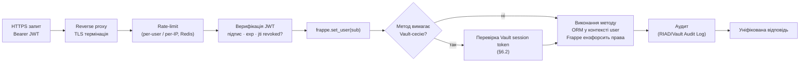
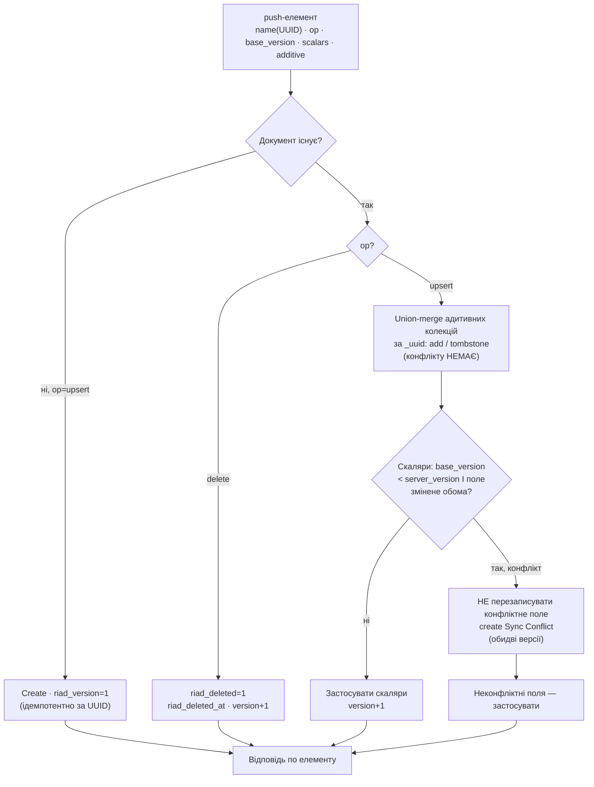
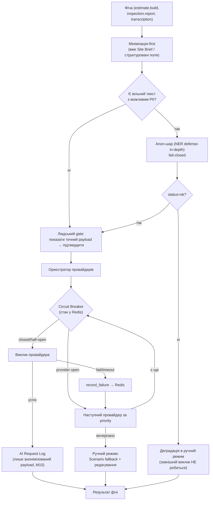
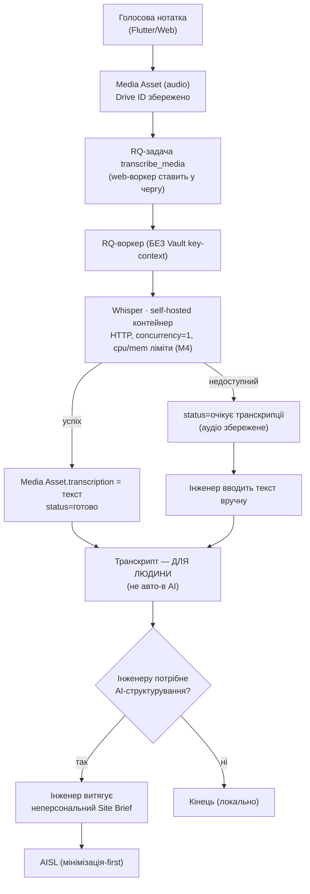
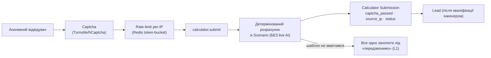
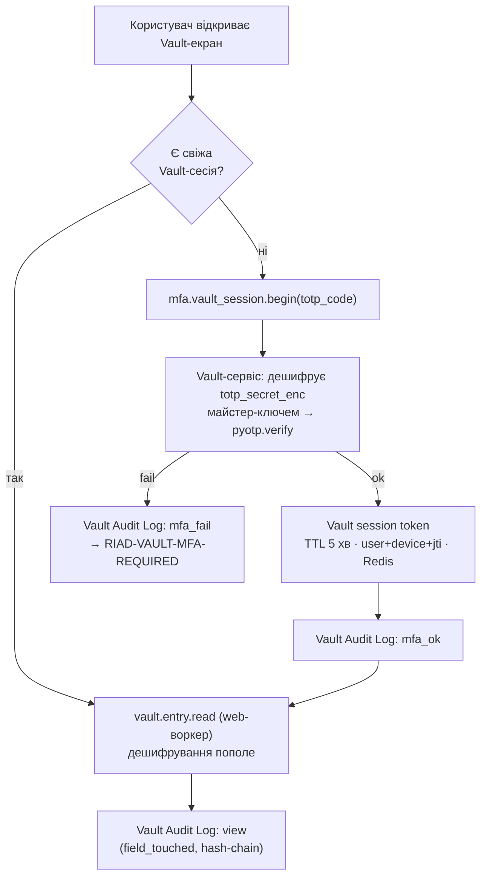

# RIAD Smart System — Фаза 3: API-архітектура + AI-модулі

> **Фаза:** 3 — API + AI
> **База:** `RIAD_Smart_System_TZ_v2.md`, `DECISIONS.md` (вкл. Фази 1, 1.5, 2), `01_architecture.md`, `015_architecture_audit.md`, `02_data_model.md`
> **Статус:** проєктування (код не пишемо)
> **Дата:** _(проставити при збереженні)_

---

## 0. Межі фази та що вона закриває

Ця фаза описує **контракти**, а не реалізацію. На вхід — готова дата-модель (20 кастомних DocType, Link-зв'язки, sync-метадані, Vault-ізоляція). На вихід:

1. **Структура RIAD API** — групи whitelisted-методів за модулями, контракт автентифікації (JWT issue/refresh, мапінг claims → Frappe User), уніфікований формат помилок, версіонування, конвеєр обробки запиту.
2. **Методи на кожен кастомний DocType** — узагальнений CRUD-патерн + спец-операції (sync push/pull, Vault-read під MFA, генерація Access Transfer Act, підтвердження AI Estimate → Quotation через адаптер).
3. **Sync-протокол** — формат push/pull, серверна версія + UUID + tombstones, union-merge адитивних колекцій vs скалярні конфлікти, ідемпотентність.
4. **AI Services Layer** — інтерфейс провайдер-адаптера, ланцюг failover, спільний Circuit Breaker у Redis, контракт анонімізації (fail-closed + людський gate), черга RQ, оркестрація Whisper.
5. **Антикорупційний адаптер ERPNext** — інкапсульовані операції, межа, ізоляція від апгрейдів.
6. **Захист периметра** — калькулятор (rate-limit + captcha), MFA-потік Vault, межі логування.

**Не входить** (передається далі): карта екранів і UI (Фаза 4), план/оцінка/ризики (Фази 5–6), конкретні Print Format клієнтського паспорта, реальний код.

**Звірка з DECISIONS:** нижче — лише операціоналізація зафіксованих рішень. Жодне базове рішення не переглядається. Резолюція відкритого питання №3 Фази 2 (Whisper-транскрипт перед AISL) — у §4.6, у руслі мінімізації-first.

---

## 1. Структура RIAD API

### 1.1 Архітектурний принцип (повторно, як рамка для контрактів)

RIAD API = **whitelisted-методи custom app** усередині Frappe-сайту. Фронтенд (Flutter / Next.js / публічний сайт) шле HTTPS-запит з JWT → метод автентифікує → перемикає контекст на конкретного Frappe User → працює через **in-process Frappe ORM** і з кастомними, і зі стандартними DocType. **Жодного внутрішнього HTTP-хопу** між «RIAD» і «ERPNext». «Через API» = межа фронтенд ↔ бекенд.

Транспорт: HTTPS через reverse proxy (Nginx/Traefik). Виклик методу — `POST /api/method/riad.api.v1.<module>.<method>`. Стандартний авто-REST на DocType (`/api/resource/...`) **не експонується назовні** — фронтенд завжди йде через явні whitelisted-методи RIAD, щоб (а) ензфорсити JWT-шар, (б) інкапсулювати доступ до стандартних DocType, (в) контролювати поверхню атаки.

### 1.2 Контракт автентифікації

**Принцип (зафіксовано, H7):** JWT лише **автентифікує** й резолвить у конкретного Frappe User. Усі ORM-операції виконуються в контексті цього user-а (`frappe.set_user`), і **права ензфорсить Frappe permission engine** як єдине джерело. JWT-claim `roles` — інформативний (для UI), **не** авторитетний; авторитет — Frappe Role на User.

#### Токени

| Токен | TTL (старт) | Зберігання на клієнті | Серверний слід |
|---|---|---|---|
| **Access JWT** | 15 хв | памʼять / `flutter_secure_storage` | stateless (перевірка підпису + `jti` проти revoked-списку) |
| **Refresh token** | 30 діб (ковзне) | `flutter_secure_storage` (mobile), httpOnly-cookie (web) | хеш у `RIAD Device Session.refresh_token_hash` |
| **Vault session token** | 5 хв (step-up, §6.2) | памʼять (ніколи не персистимо) | Redis-ключ з TTL, привʼязаний до user+device+jti |

**Підпис JWT:** HS256, секрет — **поза БД** (docker secret / файл `0400`), як і майстер-ключ Vault (DECISIONS, Фаза 1.5 №2). Алгоритм фіксований на сервері (захист від `alg=none`).

**Claims access JWT:**
```
{
  "sub":  "<frappe user name>",      // авторитетний субʼєкт
  "jti":  "<uuid сесії>",            // звірка з RIAD Device Session
  "did":  "<device_id>",
  "typ":  "access",
  "roles":["RIAD Engineer"],          // інформативно для UI, НЕ для прав
  "iat":  ..., "exp": ...
}
```

#### Потоки

**Login** — `riad.api.v1.auth.login(username, password, device)`
1. Перевірка облікових даних нативним механізмом Frappe.
2. Створення/оновлення `RIAD Device Session` (device_id, jti, refresh_token_hash, expires_at).
3. Видача `access JWT` + `refresh token`.
4. Запис у `RIAD Audit Log` (login).

**Refresh** — `riad.api.v1.auth.refresh(refresh_token)`
1. Хешуємо → шукаємо `RIAD Device Session` (не revoked, не expired).
2. **Ротація:** видаємо новий access + новий refresh, оновлюємо `refresh_token_hash`, інвалідовуємо старий (захист від повторного використання).
3. Якщо предʼявлено вже використаний (ротований) refresh → **компрометація**: revoke всієї сесії пристрою + алерт.

**Logout** — `riad.api.v1.auth.logout()` → `revoked = 1` на `RIAD Device Session` (access JWT перестає прийматись по `jti`).

**Мапінг claims → Frappe User (кожен запит):**
```
verify(JWT) → sub=user → перевірка jti не в revoked → frappe.set_user(user)
            → далі ВЕСЬ код виконується від імені user → Frappe ензфорсить row/field perms
```
Якщо метод забуде явну перевірку — Frappe однаково не віддасть документ поза правами user-а. Це і є «єдине джерело істини прав» (H7): JWT — передній вахтер, Frappe-движок — влада.

### 1.3 Конвеєр обробки запиту (middleware-ланцюг)



### 1.4 Групи whitelisted-методів за модулями

Простір імен: `riad.api.v1.<module>.<method>`. Групи відображають модулі ТЗ і DocType Фази 2.

| Модуль (namespace) | Призначення | Ключові методи |
|---|---|---|
| `auth` | автентифікація, сесії | `login`, `refresh`, `logout`, `sessions.list`, `sessions.revoke` |
| `mfa` | TOTP-enrollment + Vault step-up | `enroll.begin`, `enroll.confirm`, `vault_session.begin`, `vault_session.status` |
| `crm` | ліди, брифи | `lead.create`, `lead.convert`, `site_brief.upsert`, `site_brief.get` |
| `calculator` (**public**) | публічний калькулятор | `submit` (анонім, rate-limit+captcha), `scenario_quote` (детермінований) |
| `passport` | паспорт обʼєкта | `upsert`, `get`, `list`, `client_release.generate` |
| `map` | карта монтажу | `upsert`, `get`, `point.add`, `route.add`, `approve` |
| `estimate` | AI-кошторис | `build` (AI Project Builder), `get`, `review.submit`, `confirm` (→ Quotation) |
| `scenario` (no-code) | сценарії | `list`, `get`, `upsert`, `item.upsert` (роль `RIAD Scenario Admin`) |
| `ai_admin` (no-code) | провайдери | `provider.list`, `provider.upsert`, `provider.health`, `request_log.list` |
| `inspection` | віддалений огляд | `upsert`, `get`, `report.manual`, `report.ai_request` |
| `visit` | виїзд (offline) | `upsert`, `get` (синк — через `sync.*`) |
| `checklist` | чек-листи | `template.*` (admin), `instance.upsert`, `instance.get` |
| `media` | медіа | `register` (Drive ID), `transcription.request`, `transcription.manual` |
| `vault` | Password Vault | `entry.list`, `entry.read` (**MFA**), `entry.upsert` (**MFA**), `audit.list` |
| `act` | акт передачі доступів | `generate` (**MFA**, on-demand), `acknowledge`, `delivery.link` |
| `service` | сервіс | `request.upsert`, `request.get`, `action.add` |
| `sync` | офлайн-синк | `push`, `pull` |
| `infra` | інфра/аудит | `audit.list`, `health` |

### 1.5 Уніфікований формат відповіді й помилок

**Успіх:**
```json
{ "ok": true, "data": { ... }, "request_id": "..." }
```

**Помилка** (єдиний конверт для всіх методів):
```json
{
  "ok": false,
  "error": {
    "code": "RIAD-VAULT-MFA-REQUIRED",
    "message": "Потрібна свіжа Vault-сесія (TOTP).",
    "details": { ... },
    "request_id": "..."
  }
}
```

**Канонічні коди → HTTP:**

| Код | HTTP | Коли |
|---|---|---|
| `RIAD-AUTH-INVALID` | 401 | невалідний/прострочений JWT, revoked jti |
| `RIAD-AUTH-REFRESH-REUSE` | 401 | повторне використання ротованого refresh (компрометація) |
| `RIAD-PERM-DENIED` | 403 | Frappe permission engine відмовив (row/field) |
| `RIAD-VAULT-MFA-REQUIRED` | 403 | Vault-операція без свіжої MFA-сесії |
| `RIAD-VALIDATION` | 422 | невалідні поля / схема |
| `RIAD-SYNC-CONFLICT` | 200* | скалярний конфлікт (не помилка транспорту — частина контракту, §3) |
| `RIAD-AI-DEGRADED` | 200* | усі AI-провайдери недоступні → ручний режим (не помилка) |
| `RIAD-RATELIMIT` | 429 | перевищено ліміт (калькулятор/логін) |
| `RIAD-NOTFOUND` | 404 | документ відсутній / поза правами |
| `RIAD-INTERNAL` | 500 | непередбачена помилка (без витоку деталей) |

\* `SYNC-CONFLICT` і `AI-DEGRADED` — **очікувані бізнес-стани**, не транспортні помилки: повертаються у `data` з прапорцем, щоб UI показав злиття/деградацію без «червоного» стану. Frappe-`PermissionError` мапиться у `RIAD-PERM-DENIED` централізованим обробником, **без** розкриття внутрішніх трас.

### 1.6 Версіонування

- **Namespace-версія в шляху:** `riad.api.v1.*`. Несумісна зміна контракту → новий namespace `v2`, `v1` лишається на період депрекації (≥1 реліз мобільного клієнта).
- Клієнт пінить версію; сервер додає `X-RIAD-API-Version` у відповідь.
- **Адитивні зміни** (нові опційні поля) — у межах `v1` без зламу. Видалення/перейменування поля у відповіді — лише через `v2`.
- Offline-Flutter особливо чутливий: стара версія застосунку має лишатись робочою до примусового апдейту → депрекація з вікном, не різке вимкнення.

---

## 2. Методи на кожен кастомний DocType

### 2.1 Узагальнений CRUD-патерн

Замість сирого `/api/resource` — типовані методи на групу. Кожен **online**-DocType отримує: `get(name)`, `list(filters, fields, page)`, `upsert(payload)`, (де доречно) `submit`/`cancel`. Усі — у контексті Frappe User → права й field-level (`permlevel 1`) ензфорсяться рушієм. **Offline**-DocType (`Engineer Visit`, `Checklist Instance`, `Media Asset`, `Installation Map`) синхронізуються **тільки** через `sync.push/pull` (§3), а не прямим `upsert` з польового пристрою (щоб уся логіка версій/злиття була в одному місці).

### 2.2 Спец-операції (поза CRUD)

| Операція | Метод | Контракт / інваріант |
|---|---|---|
| **AI Project Builder** | `estimate.build(site_brief, variant)` | вхід — **Site Brief** (неперсональний); ланцюг failover (§4); результат — чернетка `AI Estimate` (`status=чернетка`). Не торкається ERPNext. |
| **Перевірка кошторису** | `estimate.review.submit(name, decision)` | `reviewed_by = поточний інженер`, `reviewed_at`; `status → на перевірці/підтверджено/відхилено`. |
| **Кошторис → ERPNext** | `estimate.confirm(name)` | **жорстка межа**: лише якщо `status=підтверджено` і `reviewed_by` присутній → **адаптер** (§5) створює `Quotation`. Інакше `RIAD-VALIDATION`. |
| **Клієнтський паспорт** | `passport.client_release.generate(passport)` | детермінований рендер **без** Vault-полів; трек у `Passport Client Release`; ніколи у Drive. |
| **Vault read** | `vault.entry.read(name, fields)` | вимагає **Vault session token** (§6.2); дешифрування лише у web-воркері; кожне поле → запис у `Vault Audit Log` (hash-chain). |
| **Vault write** | `vault.entry.upsert(payload)` | те саме MFA-обмеження; значення шифруються пополе перед записом. |
| **Акт передачі** | `act.generate(passport, entries)` | on-demand під MFA; дешифровані дані **лише в памʼяті** на момент доставки, не at-rest; `Vault Audit Log: act_generate`; ніколи у Drive (§6.3). |
| **Доставка акту** | `act.delivery.link(name)` | одноразове TTL-посилання поза Drive (механізм — відкрите питання §8.4 Фази 2, реалізація нижче §6.3). |
| **Серійник (скан)** | через `visit` sync → `erpnext_gateway.record_serial_scan` | пише в ERPNext `Serial No` лише через адаптер. |
| **Транскрипція** | `media.transcription.request(media)` | ставить RQ-задачу → Whisper (§4.6); деградація «очікує транскрипції». |

---

## 3. Sync-протокол (детально)

> Закриває контрактний бік відкритого питання №6 Фази 1 / §5 Фази 2. Реалізує: **client UUID = ідемпотентність**, **серверна монотонна версія**, **tombstones**, **union-merge адитивних колекцій**, **field-level конфлікт для скалярів**, **device-timestamps НЕ використовуються для вирішення**.

### 3.1 Інваріанти

- `name` syncable-документа = **client UUID** (autoname `field:client_uuid`). Повторний push того ж UUID — **апдейт**, не дубль.
- `riad_version` — **серверна** монотонна (+1 на кожен серверний запис). Клієнт тримає `client_base_version`.
- Адитивні child-рядки мають **власний `_uuid`** → ключ union-merge.
- Видалення — **tombstone** (`riad_deleted=1`), ніколи hard-delete; «воскресіння» неможливе.
- Pull-дельта — за **серверним** watermark (`modified`), не за годинником пристрою.

### 3.2 Push — запит

`riad.api.v1.sync.push`
```json
{
  "device_id": "android-abc",
  "batch": [
    {
      "doctype": "Engineer Visit",
      "name": "8f3c...uuid",
      "op": "upsert",
      "client_base_version": 3,
      "scalars": { "summary": "Додав 2 камери", "status": "в_роботі" },
      "additive": {
        "visit_media":   [ { "_uuid": "m1", "op": "add", "media": "media-uuid-1" } ],
        "visit_serials": [ { "_uuid": "s1", "op": "add", "serial_no": "SN-001", "item": "CAM-IP-4MP" } ]
      }
    },
    { "doctype": "Media Asset", "name": "media-uuid-1", "op": "upsert",
      "client_base_version": 0, "scalars": { "drive_file_id": "...", "media_type": "фото", "tag": "після" } },
    { "doctype": "Media Asset", "name": "media-uuid-9", "op": "delete", "client_base_version": 2 }
  ]
}
```

### 3.3 Push — серверна логіка



Ключове:
- **Адитивні колекції ніколи не конфліктують** — лише `union` за `_uuid` (двоє монтажників на одному обʼєкті → обʼєднання фото/серійників/відміток, не втрата, H3).
- **Скаляр конфліктує лише при реальному розходженні** (`base_version < server_version` **і** обидва змінили те саме поле) → `Sync Conflict`, **обидві версії показуються**, користувач обирає. Без тихого перезапису.
- **Ідемпотентність:** повтор флапнутого push з тим же UUID/тими ж `_uuid` адитивних рядків → no-op (`already_present`), без дублів.

### 3.4 Push — відповідь

```json
{
  "ok": true,
  "data": {
    "results": [
      {
        "name": "8f3c...uuid",
        "status": "merged",
        "server_version": 5,
        "additive": { "visit_media": { "added": ["m1"], "already_present": [] },
                      "visit_serials": { "added": ["s1"], "already_present": [] } },
        "conflicts": [
          { "field": "status", "server_value": "завершено", "client_value": "в_роботі",
            "conflict_id": "SC-2026-0007" }
        ]
      },
      { "name": "media-uuid-1", "status": "applied", "server_version": 1 },
      { "name": "media-uuid-9", "status": "tombstoned", "server_version": 3 }
    ]
  }
}
```
`status ∈ {applied, merged, conflict, tombstoned, ignored_duplicate}`. За наявності `conflicts` — UI показує обидві версії й викликає resolve.

### 3.5 Resolve скалярного конфлікту

`Sync Conflict` (DocType з Фази 2) тримає `server_value/client_value/.../chosen`. Метод `sync.resolve(conflict_id, chosen)`:
- `chosen=client` → застосувати клієнтське значення, `version+1`;
- `chosen=server` → лишити серверне;
- у будь-якому разі `resolved=1`, `resolved_by`. **Без** автоматики — рішення людини (à la Google Docs).

### 3.6 Pull — дельта

`riad.api.v1.sync.pull`
```json
{ "device_id": "android-abc", "watermark": "<opaque server token>" }
```
Сервер повертає всі syncable-документи (у межах **прав user-а** — Frappe фільтрує), у яких серверний `modified > watermark`, **включно з tombstones**:
```json
{ "ok": true, "data": {
    "changes": [
      { "doctype": "Engineer Visit", "name": "...", "riad_version": 6, "riad_deleted": 0, "fields": {...},
        "additive": { "visit_media": [ {"_uuid":"m1", ...} ], "visit_serials": [...] } },
      { "doctype": "Media Asset", "name": "media-uuid-9", "riad_version": 3, "riad_deleted": 1 }
    ],
    "next_watermark": "<opaque server token>"
} }
```
- `watermark` — **непрозорий серверний токен** (інкапсулює серверний `modified`-зріз). Клієнт лише зберігає й повертає його. **Годинник пристрою не бере участі** ні в pull, ні в conflict-resolution (H3).
- Клієнт застосовує дельту до локального SQLite (Drift), tombstones → локальне видалення, просуває watermark.
- **Vault / AI Estimate / фінанси у pull НЕ потрапляють** — online-only (§5 Фази 2).

---

## 4. AI Services Layer (AISL)

### 4.1 Загальна форма

AISL — **оркестрація**, не моделі. Усе зовнішнє йде лише через нього й лише з **анонімізованими/мінімізованими** даними. CI import-linter забороняє AISL/anon/adapters імпортувати Vault-пакет і навпаки (Фаза 1.5). AI/RQ-воркери **не мають ключ-контексту Vault**.



### 4.2 Інтерфейс провайдер-адаптера (контракт, не код)

Узгоджений інтерфейс для всіх провайдерів (Gemini / OpenAI / Claude / інші):

| Метод | Вхід | Вихід |
|---|---|---|
| `name()` | — | стабільний ідентифікатор (= `AI Provider.provider_name`) |
| `complete(task, payload, params)` | `task` (project_builder / inspection_report / …), **анонімізований** payload, params (model, max_tokens, timeout) | `AIResult{ status, content, tokens, latency_ms, raw_provider_meta }` |
| `health_check()` | — | `healthy / degraded / down` |

- **Додати провайдера = додати адаптер + рядок `AI Provider`** (no-code), без зміни оркестратора.
- **Ключі API — не в БД**, а в секретах сервера (як майстер-ключ). `AI Provider` тримає лише `endpoint/model/priority/is_enabled/health`.
- Адаптер відповідає за маршалінг у формат конкретного провайдера й нормалізацію відповіді в `AIResult`.

### 4.3 Ланцюг failover

Порядок — `AI Provider.priority` серед `is_enabled`. Для кожного: перевірка Circuit Breaker → виклик → успіх повертає, помилка/таймаут реєструється й переходить далі. Вичерпання ланцюга / усі breaker-и open → **ручний режим** (рівень 3): детермінований `Scenario` + ручне редагування. UI показує `origin = AI-основний / AI-резервний / ручний-сценарій` (поле в `AI Estimate`).

### 4.4 Circuit Breaker — спільний стан у Redis (M9)

Breaker **не per-process** (інакше кожен web/RQ-воркер має власне уявлення про живість провайдера). Стан — у Redis, спільний для всіх воркерів:

```
Ключ: cb:provider:<name>
Поля: state ∈ {closed, open, half_open}, failures, opened_at, last_change
```

Параметри (старт, конфігуровані):
- `failure_threshold = 5` поспіль помилок/таймаутів → `open`.
- `open_timeout = 60s` → після цього `half_open` (пропускає 1 пробний виклик).
- успіх у `half_open` → `closed` (скидання лічильника); помилка → знову `open`.

Зміни стану — атомарно (Lua-скрипт/`WATCH`), щоб конкуренція воркерів не «розʼїхалась». Кешований `health_status` дублюється в `AI Provider` для UI/адмінки, але **джерело істини — Redis**.

### 4.5 Контракт анонімізації (мінімізація-first + fail-closed + людський gate)

Зафіксовано (H1/H2, M10). Деталі контракту:

- **Мінімізація-first — головний рубіж.** Основний потік (`estimate.build`) приймає **Site Brief** — неперсональну сутність. PII туди не потрапляє за конструкцією → чистити нема чого. Це знімає більшість ризику NER.
- **Anon-шар (NER) — defense-in-depth**, лише для шляхів з вільним текстом (напр. ручні нотатки), не єдиний рубіж. Контракт:
  - Вхід: `raw_text`.
  - Вихід: `AnonResult{ status ∈ {ok, uncertain, error}, text, entities_found[], confidence }`.
  - **fail-closed:** `status != ok` → зовнішній виклик **не робиться**, фіча деградує в ручний режим. **Ніколи fail-open.**
- **Людський gate:** там, де вільний текст усе ж іде назовні, інженеру показується **точний payload** + одна кнопка підтвердження. Без підтвердження — нічого не виходить за периметр.
- **Фото:** `Media Asset.ai_allowed` default 0 → **сирі фото за замовчуванням не йдуть у зовнішній AI** (H2). Аналіз фото моделлю — окремий під-проєкт (self-hosted CV-редакція + fail-closed), не «галочка».
- **Логування (M10):** на межі AISL у `AI Request Log.anonymized_payload` пишеться **лише анонімізоване**; сирий ввід ніколи не логується на цьому рівні. Логер стоїть **після** anon-шару.

### 4.6 Оркестрація Whisper + черга RQ (резолюція ВП №3 Фази 2)



**Резолюція відкритого питання №3 (Whisper-транскрипт перед AISL):** оскільки укр. NER ненадійний, **транскрипт за замовчуванням НЕ авто-передається в зовнішній AI**. Він — для інженера (як ручний звіт огляду / нотатка). Якщо потрібне AI-структурування, інженер **сам формує неперсональний Site Brief** з транскрипту — і вже Site Brief (без PII) іде в AISL. Це послідовно з мінімізацією-first: «те, що ніколи не покидає периметр, не треба чистити». Альтернатива (авто-scrub транскрипту через NER + людський gate) лишається **опційним** шляхом defense-in-depth, але не дефолтом. → Не суперечить DECISIONS; уточнює.

### 4.7 RQ-задачі AISL (повний перелік)

| Задача | Тригер | Деградація |
|---|---|---|
| `transcribe_media` | голосова нотатка | «очікує транскрипції» → ручний текст |
| `ai_estimate_build` (довгі) | важкий project_builder | синхронний шлях для коротких; черга для довгих; failover у §4.3 |
| `ai_retry` | breaker half-open / повтор | за станом Redis-breaker |
| `inspection_report_build` | звіт віддаленого огляду | «очікує AI» → ручний звіт |

Redis-черга — з **AOF-персистентністю** (M2), щоб рестарт не губив задачі.

---

## 5. Антикорупційний адаптер ERPNext (M3)

### 5.1 Призначення й межа

Єдиний модуль custom app (`riad.erpnext_gateway`), через який RIAD читає/пише **стандартні** DocType ERPNext. **Жоден** кастомний DocType-контролер не викликає `frappe.get_doc("Quotation"/"Sales Order"/...)` напряму — лише через gateway. Link-поля у дата-моделі дозволені (це лише ID), але **читання/запис полів** стандартних документів інкапсульовано.

### 5.2 Інкапсульовані операції

| Функція gateway | Стандартний DocType | Викликається з |
|---|---|---|
| `create_quotation_from_estimate(estimate)` | `Quotation` | `estimate.confirm` (після перевірки інженером) |
| `create_sales_order(quotation)` | `Sales Order` | підтвердження замовлення |
| `get_item_pricing(item, price_list)` | `Item Price` | побудова кошторису |
| `record_serial_scan(serial, item, ...)` | `Serial No` | sync виїзду/чек-листа |
| `link_warranty_claim(service_request)` | `Warranty Claim` | гарантійне звернення |
| `reconcile_payment(invoice, tx)` | `Payment Entry` | майбутня звірка Monobank |
| `resolve_customer(lead)` | `Customer`/`Lead`/`Contact`/`Address` | конвертація ліда, PII живе тут |

Кожна функція приймає/повертає **внутрішні RIAD-DTO**, не сирі Frappe-документи → решта коду не «знає» схему ERPNext.

### 5.3 Ізоляція від апгрейдів v15 → v16

- Зміна полів/хуків/валідацій ERPNext при апгрейді **зачіпає лише gateway**, не весь RIAD.
- Контрактні тести gateway («створює Quotation з N позицій», «пише Serial No») — як індикатор зламу після апгрейда.
- **CI-конвенція** (доповнення до Vault import-linter): заборона згадувати імена стандартних ERPNext-DocType у строкових літералах поза `erpnext_gateway` (лінт-правило + код-рев'ю). Це робить антикорупційну межу перевірюваною, не лише декларативною.
- Жорстка межа потоку `AI Estimate → Quotation` проходить **через** gateway: `estimate.confirm` → `gateway.create_quotation_from_estimate`. Інших шляхів запису Quotation немає.

---

## 6. Захист периметра

### 6.1 Публічний калькулятор (H5)



- **Без live зовнішнього AI для анонімів** — попередня оцінка лише з `Scenario` (детерміновано). Зовнішній AI — тільки після кваліфікації ліда інженером (де вже Site Brief).
- **Rate-limit per-IP** (token-bucket у Redis) + **captcha** перед сабмітом. `source_ip` — `permlevel 1`.
- **Антиспам лід-форми**; `status=спам` для відсіву.
- **Контакти зберігаються** (для дзвінка), але **в жоден AI-запит не йдуть** (лише `object_type/area/cameras/archive`).
- Graceful: недоступність розрахунку ≠ втрата ліда (L1).

### 6.2 MFA-потік Vault (step-up)



Інваріанти:
- Дешифрування **лише у web-воркері** під MFA-валідованою людською сесією. **AI/RQ-воркери не мають ключ-контексту** → не можуть дешифрувати навіть при виклику (Фаза 1.5).
- Vault session token — **короткий TTL (5 хв)**, не персиститься на клієнті, привʼязаний до пристрою+jti.
- **Кожен** доступ → запис у `Vault Audit Log` (єдиний глобальний **hash-chain**, append-only, без update/delete-прав).
- **Online-only:** нічого не пишеться в локальний SQLite (зафіксовано Фазою 1.5). Винятковий офлайн-кеш під наряд (шифрований+TTL+wipe) — лишається майбутньою опцією, не дефолт.

### 6.3 Акт передачі доступів — доставка (H6, уточнення ВП №4 Фази 2)

- Генерація — `act.generate` під MFA, `Vault Audit Log: act_generate`.
- Дешифровані дані **матеріалізуються лише в памʼяті на момент доставки**, не зберігаються at-rest у `Access Transfer Act` (там — лише `included_entries` як **ref** на `Vault Entry`, без значень).
- **Ніколи у Drive.** Доставка — `act.delivery.link`: **одноразове TTL-посилання**, що обслуговується **самим Frappe-сайтом** (не Drive): сервер генерує токен з коротким TTL → за переходом рендерить захищений вміст один раз під TLS → інвалідовує токен. Альтернативи: друк / захищений PDF (пароль окремим каналом). Не email-вкладенням.
- `client_acknowledged` фіксує підтвердження клієнта.

### 6.4 Межі логування (зведено)

| Межа | Що можна логувати | Що заборонено |
|---|---|---|
| AISL → зовнішній AI | анонімізований payload (`AI Request Log`) | сирий PII, сирий вхід до anon |
| Vault | метадані доступу (хто/коли/яке поле) | дешифровані значення, `*_enc` |
| Reverse proxy / app | request_id, статус, латентність | тіла з PII/секретами, заголовок `Authorization` |
| Помилки | канонічний код + request_id | внутрішні траси/стек назовні |

---

## 7. Прийняті рішення Фази 3 (у межах конституції)

1. **Авто-REST `/api/resource` не експонується** — лише явні whitelisted-методи `riad.api.v1.*` (контроль JWT-шару, поверхні атаки, інкапсуляції ERPNext).
2. **Тришарова токен-модель:** access JWT (15 хв) + ротований refresh (у `RIAD Device Session`) + окрема **Vault session** (step-up, 5 хв, Redis, web-only).
3. **JWT лише автентифікує → `frappe.set_user` → права ензфорсить Frappe** (операціоналізація H7); `roles` у claim — інформативні.
4. **Уніфікований конверт відповіді/помилок** з канонічними кодами; `SYNC-CONFLICT` і `AI-DEGRADED` — бізнес-стани в `data`, не транспортні помилки.
5. **Версіонування namespace** `v1` з вікном депрекації (критично для offline-Flutter).
6. **Sync-контракт:** push (UUID + base_version + scalars + additive) → union-merge колекцій / field-level конфлікт скалярів / tombstones / ідемпотентність; pull-дельта за **серверним** watermark; годинник пристрою не бере участі.
7. **Провайдер-адаптер** з єдиним інтерфейсом `complete/health_check`; додавання провайдера = адаптер + рядок `AI Provider` (no-code); ключі — поза БД.
8. **Circuit Breaker — у Redis** (спільний стан, M9), атомарні переходи; `AI Provider.health` — кеш для UI, джерело істини — Redis.
9. **Анонімізація:** мінімізація-first (Site Brief) як головний рубіж, NER — defense-in-depth, **fail-closed**, людський gate; сирі фото за замовчуванням не в AI; лог лише анонімізованого.
10. **Whisper-транскрипт за замовчуванням НЕ авто-в зовнішній AI** — для людини; AI-структурування лише через інженер-сформований Site Brief (резолюція ВП №3 Фази 2).
11. **Антикорупційний gateway** — єдина точка доступу до стандартних DocType; RIAD-DTO замість сирих Frappe-документів; CI-лінт на згадки ERPNext-DocType поза gateway; межа потоку `estimate.confirm → gateway.create_quotation`.
12. **Калькулятор:** captcha + rate-limit per-IP (Redis) + детермінований Scenario без live-AI; graceful-захоплення ліда.
13. **Vault step-up MFA**, дешифрування web-only, кожен доступ у hash-chain аудит; **Акт** — TTL-посилання з самого сайту (не Drive), дані лише в памʼяті на доставку.

---

## 8. Відкриті питання (передається далі)

1. **Конкретний captcha-провайдер** (Cloudflare Turnstile vs hCaptcha) і пороги rate-limit калькулятора/логіну — Фаза 4/безпека.
2. **Параметри Circuit Breaker під реальний трафік** (threshold/timeout) — підбір на staging; стартові значення вказані.
3. **Формат і термін TTL одноразового посилання Акту** + чи дозволяти повторну генерацію — фаза безпеки.
4. **Гранулярність «свої обʼєкти» монтажника** (по `customer` / по призначенню на `Engineer Visit` / по полю команди) — успадковано з Фази 2 §9.1; впливає на User Permission у методах `*.list/get`. Потрібне рішення перед кодуванням API.
5. **Синхронний vs черговий поріг `estimate.build`** (коли йти в RQ) — підбір за латентністю провайдерів.
6. **Push-нотифікації (FCM)** статусів AI/синку — позначено на UX-фазу (Фаза 4), контракт `RIAD Device Session.push_token` уже є.
7. **Бібліотека/покриття укр. NER** для defense-in-depth (Presidio+spaCy vs власні правила) — успадковано з Фази 1; не блокує, бо дефолт — мінімізація-first.

> Жодне з цих питань **не блокує** перехід до Фази 4 (UX): API-контракти, sync-протокол, AI-потоки, межі безпеки визначені — є на що вішати екрани.

---

## 9. Що НЕ входить у Фазу 3 (передано далі)

- Карта екранів, UI-система, відображення sync-конфліктів і Vault-MFA в UI, push — **Фаза 4**.
- План розробки, оцінка складності кожного етапу — **Фаза 5**.
- Ризики, варіанти масштабування, фінальний аудит — **Фаза 6**.
- Реальний код методів, адаптерів, anon-шару — **після завершення проєктування**.

---

## 10. Блок для DECISIONS.md (Фаза 3)

```
## Фаза 3 — API-архітектура + AI-модулі — [дата]
### Прийняті рішення
- Поверхня API = лише whitelisted-методи riad.api.v1.*; авто-REST /api/resource назовні не експонується.
- Токени: access JWT (15 хв) + ротований refresh (у RIAD Device Session, reuse-detection) +
  окрема Vault session (step-up TOTP, 5 хв, Redis, web-worker only).
- JWT лише автентифікує → frappe.set_user → права ензфорсить Frappe permission engine (H7);
  claim roles — інформативний, не авторитетний.
- Уніфікований конверт {ok,data|error{code,message,request_id}}; канонічні коди; SYNC-CONFLICT і
  AI-DEGRADED — бізнес-стани в data (не транспортні помилки). Frappe PermissionError → RIAD-PERM-DENIED.
- Версіонування namespace v1 з вікном депрекації (критично для offline-Flutter).
- Sync-контракт: push(name=UUID, client_base_version, scalars, additive) → union-merge адитивних
  колекцій за _uuid (без конфлікту) / field-level конфлікт скалярів → Sync Conflict (обидві версії) /
  tombstones / ідемпотентність за UUID. Pull = дельта за СЕРВЕРНИМ watermark (opaque token);
  годинник пристрою не бере участі ні в pull, ні в resolve. Vault/AI Estimate/фінанси у pull не йдуть.
- AI: провайдер-адаптер з єдиним інтерфейсом complete()/health_check(); додати провайдера =
  адаптер + рядок AI Provider (no-code); ключі API поза БД. Failover основний→резервний→ручний(Scenario).
- Circuit Breaker — спільний стан у Redis (атомарні переходи, M9); AI Provider.health — кеш для UI.
- Анонімізація: мінімізація-first (Site Brief) — головний рубіж; NER — defense-in-depth; fail-closed;
  людський gate перед відправкою; сирі фото за замовчуванням не в AI (ai_allowed=0); лог лише
  анонімізованого payload (M10).
- Whisper-транскрипт за замовчуванням НЕ авто-в зовнішній AI — для людини; AI-структурування лише
  через інженер-сформований Site Brief (РЕЗОЛЮЦІЯ ВП №3 Фази 2).
- RQ-задачі: transcribe_media, ai_estimate_build(довгі), ai_retry, inspection_report_build;
  Redis-черга з AOF (M2). Whisper — окремий контейнер, concurrency=1, cpu/mem-ліміти (M4).
- Антикорупційний gateway (riad.erpnext_gateway) — єдина точка доступу до стандартних DocType;
  RIAD-DTO замість сирих Frappe-доків; CI-лінт на згадки ERPNext-DocType поза gateway; ізолює
  v15→v16. Межа потоку: estimate.confirm (status=підтверджено + reviewed_by) → gateway.create_quotation.
- Калькулятор: captcha + rate-limit per-IP (Redis token-bucket) + детермінований Scenario без live-AI;
  graceful-захоплення ліда; source_ip permlevel 1.
- Vault step-up MFA: дешифрування web-only під свіжою Vault-сесією; кожен доступ → Vault Audit Log
  (hash-chain). Access Transfer Act: on-demand під MFA, дані лише в памʼяті на доставку (не at-rest),
  доставка — одноразове TTL-посилання з самого сайту (НЕ Drive)/друк/захищений PDF.
### Відкриті питання
- Captcha-провайдер + конкретні пороги rate-limit (калькулятор/логін) — Фаза 4/безпека.
- Параметри Circuit Breaker під реальний трафік — підбір на staging.
- Формат/TTL одноразового посилання Акту + політика повторної генерації — фаза безпеки.
- Гранулярність «свої обʼєкти» монтажника (customer/призначення/команда) — рішення перед кодуванням API.
- Поріг синхронний vs RQ для estimate.build — підбір за латентністю.
- Бібліотека/покриття укр. NER (defense-in-depth) — не блокує (дефолт = мінімізація-first).
### Що це блокує / розблоковує
- РОЗБЛОКОВУЄ Фазу 4 (UX): визначені API-контракти, sync-протокол (включно з відображенням
  конфліктів), AI-потоки й деградації, MFA-потік Vault, перелік станів для екранів.
- РОЗБЛОКОВУЄ Фази 5–6: є контракти для оцінки складності й аналізу ризиків.
- НЕ блокує: відкриті питання — деталі реалізації/тюнінгу наступних фаз.
```
