# RIAD Smart System — Фаза 4: UX-карта екранів

> **Фаза:** 4 — UX-карта екранів
> **База:** `RIAD_Smart_System_TZ_v2.md`, `DECISIONS.md` (вкл. Фази 1, 1.5, 2, 3), `01_architecture.md`, `015_architecture_audit.md`, `02_data_model.md`, `03_api_ai_architecture.md`
> **Статус:** проєктування (код не пишемо)
> **Дата:** _(проставити при збереженні)_

---

## 0. Межі фази та що вона закриває

Ця фаза описує **екрани, навігацію й відображення станів** — не верстку й не код. На вхід — готові контракти Фази 3 (whitelisted-методи, уніфікований конверт помилок, sync-протокол, AI-failover, MFA-потік Vault) і дата-модель Фази 2 (20 кастомних DocType, RBAC-матриця, field-level `permlevel 1`). На вихід:

1. Карта екранів трьох поверхонь (Flutter / Next.js PWA / публічний сайт), згрупована за ролями й модулями ТЗ + навігаційна модель.
2. Ключові екранні флоу з відображенням станів Фази 3.
3. Каталог станів UI: AI-деградація, sync-конфлікт (вибір версії), «очікує транскрипції/AI», MFA-required, помилки/rate-limit/offline.
4. Field-level у UX як **відображення Frappe-прав**, не UI-only приховування (H7).
5. Офлайн-UX: індикатори синку, черга змін, tombstones, поведінка без мережі.
6. UI-система й дизайн-напрям (Monobank/Ajax): принципи, не піксельний дизайн.

**Закриває відкриті питання:** ВП №2 Фази 2 (geolocation vs план-локальні x/y — §6.6), ВП №6 Фази 3 (push-нотифікації — §11), ВП №5 Фази 1 (UI-система — §10). Гранулярність «свої обʼєкти» монтажника впливає на UX списків, але **залишається** рішенням перед кодуванням API (не вирішується мовчки тут — §13).

**Не входить** (далі): план розробки й оцінка (Фаза 5), ризики/масштабування/фінальний аудит (Фаза 6), реальна верстка й код.

---

## 1. Принципи UX (рамка для всіх екранів)

Десять правил, на яких тримається вся карта нижче. Усі — операціоналізація конституції й зафіксованих пріоритетів UX (швидкість → мінімум кліків → мобільний сценарій → авто-темна тема → рівень Monobank/Ajax).

1. **Одна дія = один екран.** Кожен швидкий шлях («новий лід», «скан серійника») завершується за 1–3 тапи. Жодних багатотабових форм ERP.
2. **Прогресивне розкриття.** За замовчуванням видно мінімум полів; «розширені» поля — під згортанням. Категорично без «стіни полів» (ТЗ).
3. **Стан системи завжди видимий, але ненавʼязливий.** AI-статус, статус синку, offline-режим — компактні індикатори в шапці, не модалки.
4. **AI ніколи не блокує.** Будь-який AI-екран має ручний еквівалент **на тому самому екрані** (не окремий режим). Деградація = зміна під-стану кнопки, а не недоступність функції.
5. **Права — джерело істини інтерфейсу.** UI рендериться з того, що **Frappe фактично віддав** (поля/рядки). Немає поля у відповіді → немає елемента. Жодного «намалювати й приховати CSS» (H7).
6. **Гроші — привілейований шар.** Закупівля/прибуток/маржа (`permlevel 1`) показуються лише там, де сервер їх віддав. Для монтажника вони структурно відсутні, не «заблюрені».
7. **Конфлікт — це вибір, не помилка.** Sync-конфлікт показує **обидві версії** поряд і просить обрати; ніколи не перезаписує тихо (à la Google Docs).
8. **Vault — окремий ментальний контур.** Вхід у Vault — це step-up (MFA-екран), окрема візуальна «зона безпеки», online-only, кожен перегляд видимий як «записано в аудит».
9. **Офлайн — нормальний стан, не аварія.** Польовий екран однаково працює без мережі; синк відкладений і прозорий (черга змін, лічильник pending).
10. **Темна тема — дефолт, не опція.** Авто за системою, з ручним перемикачем. Дизайн-токени проєктуються dark-first (§10).

---

## 2. Навігаційна модель трьох поверхонь

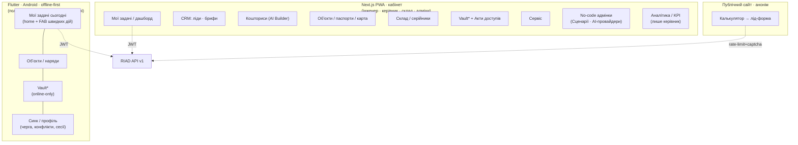

**Принципи навігації:**

- **Flutter — bottom-nav з 4 вкладок** (Задачі · Обʼєкти · Vault · Синк/профіль) + плаваюча кнопка швидких дій (FAB). Глибина ≤ 3 рівні. Vault-вкладка завжди видима, але при offline показує банер «Vault доступний лише онлайн».
- **PWA — ліва бічна навігація (collapsible)**, що рендериться **за фактичними ролями** користувача: монтажник не отримує пунктів «Кошториси/Аналітика/Vault-write» взагалі (не «сірі», а відсутні). Топбар: пошук обʼєкта + AI-статус + аватар.
- **Публічний сайт — лінійна воронка** (1 екран, прокрутка): параметри → миттєва детермінована оцінка → контакти → подяка. Без навігації/меню.
- **Спільний шар авторизації** (JWT) для Flutter і PWA; ролі в claim — лише для **показу/приховування навігації** (інформативно), фактичні дані — від Frappe (H7).

---

## 3. Карта екранів — Flutter (offline-first, польовий)

Поверхня для **польового сценарію**: монтажник (основний) та інженер у виїзді. Усе, крім Vault, працює без мережі.

| Екран | Модуль ТЗ | Ролі | DocType / метод | Sync | Ключові стани |
|---|---|---|---|---|---|
| **Логін + вибір пристрою** | Безпека | усі | `auth.login` | online | `RIAD-AUTH-INVALID`, `RIAD-RATELIMIT` (логін) |
| **Мої задачі сьогодні** (home) | Головний екран | усі | realtime + локальний кеш | offline-aware | offline-банер, лічильник pending-синку |
| **Швидкі дії (FAB)** | Головний екран | за роллю | — | — | пункти за правами (новий лід* / прорахунок* / огляд / виїзд / сервіс) |
| **Картка обʼєкта (наряд)** | Паспорт обʼєкта | інженер RW, монтажник R (свої) | `passport.get` (online), кеш | переважно online | «лише операційне» для монтажника |
| **Виїзд інженера** | Виїзд (offline) | інженер RW, монтажник RW (свої) | `Engineer Visit` через `sync.*` | **offline-first** | чернетка/в_роботі/завершено, конфлікт скаляра |
| **Чек-лист монтажу** | Монтаж | інженер RW, монтажник RW (свої) | `Checklist Instance` через `sync.*` | **offline-first** | відмітки = union-merge; фото/серійник за пунктом |
| **Скан серійника / QR / штрихкод** | Монтаж / Склад | монтажник, інженер | `visit_serials` (адитив) → `Serial No` (адаптер) | **offline-first** | дубль-скан = `ignored_duplicate` |
| **Камера: фото до/після, відео СММ** | Монтаж | монтажник, інженер | `Media Asset` (Drive ID) через `sync.*` | **offline-first** | `ai_allowed=0` за замовч.; тег до/після/СММ |
| **Голосова нотатка** | Огляд / AI Builder | інженер | `Media Asset` (audio) → `transcription.request` | **offline-first** (аудіо), online (транскрипція) | `transcription_status`: немає/очікує/готово/ручний |
| **Карта монтажу (точки)** | Карта обʼєкта | інженер RW (+затвердж.), монтажник RW (точки/статуси/фото) | `Installation Map` через `sync.*` | **offline-first** | план приміщення (x/y) vs територія (GPS) — §6.6 |
| **Віддалений огляд** | Віддалений огляд | інженер RW, монтажник R (свої) | `Remote Inspection` | медіа offline, звіт online | очікує_AI / ручний звіт |
| **Сервісна заявка (польова частина)** | Сервіс | інженер, монтажник (призначені) | `Service Request` / `Service Action` | дії offline | без фінансів для монтажника |
| **Vault (перегляд позицій наряду)** | Password Vault | монтажник — за замовч. немає; винятково R під MFA online | `vault.entry.read` (**MFA**) | **online-only** | MFA-екран; банер «лише онлайн»; «записано в аудит» |
| **Синк / черга змін** | Надійність / offline | усі | `sync.push/pull` | — | pending N, конфлікти, помилки push |
| **Розвʼязання конфлікту синку** | Offline-конфлікти | власник документа | `sync.resolve` | — | обидві версії, вибір користувача |
| **Профіль / сесії / MFA-enrollment** | Безпека | усі | `auth.sessions.*`, `mfa.enroll.*` | online | TOTP-enrollment, ревок сесій |

\* «новий лід / прорахунок» у Flutter — лише для інженера; монтажник цих пунктів FAB не бачить.

---

## 4. Карта екранів — Next.js PWA (кабінет)

Поверхня для **кабінетного сценарію**: інженер-проєктувальник, керівник, склад, no-code адміни, безпека. Встановлюваний PWA, темна тема, online (з graceful-обробкою втрати мережі — read-кеш TanStack Query).

| Екран | Модуль ТЗ | Ролі | DocType / метод | Ключові стани |
|---|---|---|---|---|
| **Логін + MFA-enrollment** | Безпека | усі | `auth.login`, `mfa.enroll.*` | `RIAD-AUTH-*`, `RIAD-RATELIMIT` |
| **Дашборд / Мої задачі** | Головний екран | усі | realtime socketio | AI-статус-чип у топбарі |
| **Аналітика / KPI** | Ролі: керівник | керівник | `infra.*`, агрегати | прибутковість, маржа (permlevel 1 видно) |
| **Ліди (список + картка)** | CRM | інженер RW, керівник R | `crm.lead.*` | джерело: калькулятор/ручне |
| **Створення/кваліфікація ліда** | CRM | інженер | `crm.lead.create/convert` | мінімум полів, прогресивне розкриття |
| **Site Brief (редактор)** | CRM / приватність | інженер RW | `crm.site_brief.upsert` | «це йде в AI» — неперсональні поля |
| **AI Project Builder (кошторис)** | AI Project Builder | інженер RW (L1), керівник RW (L1) | `estimate.build/get` | origin: AI-осн/AI-рез/ручний; `AI-DEGRADED` |
| **Людський gate «що піде в AI»** | Приватність (H1) | інженер | (перед `estimate.build` зі вільним текстом) | показ точного payload + підтвердження |
| **Перевірка й підтвердження кошторису** | Кошторис | інженер, що виставляє рахунок | `estimate.review.submit`, `estimate.confirm` | чернетка→на перевірці→підтверджено→Quotation |
| **Варіанти (дешевий/оптимальний/преміум)** | Кошторис | інженер/керівник | `estimate.build(variant)` | перемикач варіанта |
| **Паспорт обʼєкта (внутрішній)** | Паспорт обʼєкта | інженер RW, керівник R, склад R | `passport.*` | внутрішні нотатки (інженер/керівник) |
| **Клієнтська версія паспорта** | Паспорт обʼєкта | інженер/керівник RW | `passport.client_release.generate` | без Vault-полів; захищена доставка |
| **Карта монтажу (редактор + затвердження)** | Карта обʼєкта | інженер RW (затвердж.), керівник R | `map.*`, `map.approve` | затвердження = лише інженер |
| **Карта обʼєктів (геокарта)** | Карта обʼєктів | керівник, інженер | агрегат паспортів (`geo`) | ліди/монтажі/сервіси/завершені |
| **Склад: прихід / серійники / залишки** | Склад | склад RW, керівник R | адаптер ERPNext (`Serial No`, Stock) | без AI |
| **Сценарії (no-code)** | База сценаріїв | `RIAD Scenario Admin`, керівник RW | `scenario.*` | форми позицій, `qty_rule` |
| **Чек-лист-шаблони (no-code)** | Монтаж | `RIAD Scenario Admin`, керівник RW | `checklist.template.*` | requires_photo/serial/value |
| **AI-провайдери (no-code адмін)** | AI failover | `RIAD AI Admin`, керівник R | `ai_admin.provider.*`, `health` | health: healthy/degraded/down; priority |
| **AI Request Log** | Аудит AI | `RIAD AI Admin`, керівник R | `ai_admin.request_log.list` | лише анонімізований payload |
| **Vault (список + перегляд)** | Password Vault | керівник R (MFA), інженер RW (MFA) | `vault.entry.*` (**MFA**) | step-up екран, online-only, аудит |
| **Vault Audit (журнал доступу)** | Безпека | керівник R, інженер R (власні) | `vault.audit.list` | hash-chain, read-only |
| **Акт передачі доступів** | Акт передачі | інженер/керівник RW (MFA) | `act.generate/delivery.link/acknowledge` | дані лише на доставку; TTL-посилання |
| **Сервіс (заявки + історія)** | Сервіс | інженер RW, керівник R, склад R | `service.*` | історія паролів = ref на Vault Audit |
| **Сесії / пристрої / ревок** | Безпека | усі (self), адмін (усі) | `auth.sessions.*` | reuse-detection алерт |

---

## 5. Карта екранів — Публічний сайт (калькулятор)

Анонімна лінійна воронка. **Без live зовнішнього AI** (H5): оцінка — детермінований розрахунок зі `Scenario`. Захист: captcha + rate-limit per-IP.

| Крок (екран-секція) | DocType / метод | Стани |
|---|---|---|
| **Параметри обʼєкта** | (локально) | тип / площа / камери / архів — без PII |
| **Миттєва попередня оцінка** | `calculator.scenario_quote` (детермінований) | matched-scenario / «передзвонимо» (L1) якщо шаблон не зматчився |
| **Контакти (опційно)** | `calculator.submit` | captcha (Turnstile) → rate-limit; контакти **не йдуть в AI** |
| **Подяка / лід захоплено** | `Calculator Submission` → `Lead` | `RIAD-RATELIMIT` → мʼяке повідомлення «спробуйте пізніше» |

> **Конфіденційність на екрані:** під полем контактів — мікротекст «Площа й тип потрібні для розрахунку; імʼя й телефон — лише щоб передзвонити, в AI вони не передаються». Це робить мінімізацію видимою для клієнта.

---

## 6. Ключові екранні флоу

### 6.1 Головний екран «Мої задачі сьогодні»

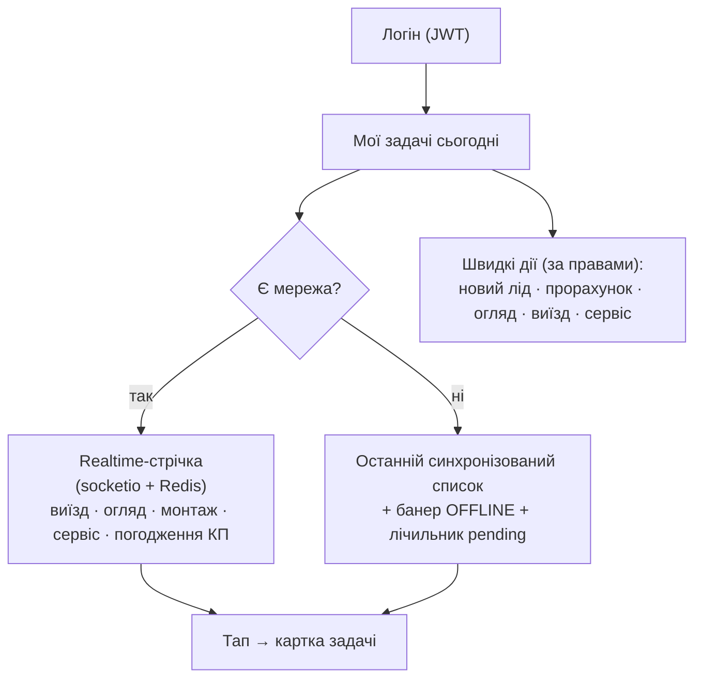

- Realtime оновлює список задач і **AI-статус-чип** (зелений/жовтий/сірий — §7.1) без перезавантаження.
- Offline: список замороженого стану + банер; швидкі дії, доступні офлайн (виїзд/монтаж/скан/фото/нотатка), лишаються активними; недоступні офлайн (прорахунок/Vault) показують підказку «потрібна мережа».

### 6.2 Створення ліда

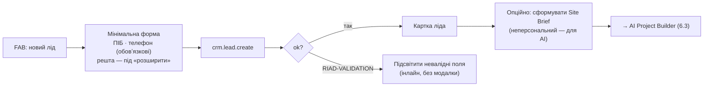

PII (ПІБ/адреса/контакти) живе на `Lead`/`Contact`/`Address`; у Site Brief і далі в AI **не потрапляє за конструкцією**.

### 6.3 AI Project Builder + перевірка інженером

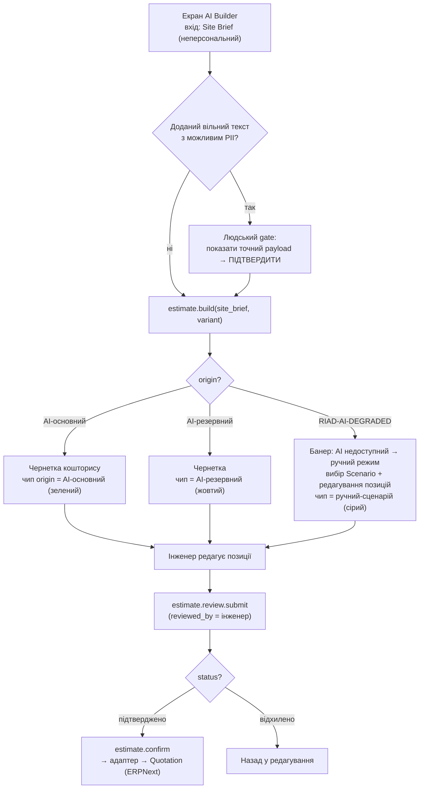

- **Жорстка межа:** кнопка «Створити КП в ERPNext» **disabled**, доки `status ≠ підтверджено` і немає `reviewed_by`. AI ніколи не створює Quotation сам.
- Деградація AI — це **банер + зміна стану кнопки «Згенерувати»** на «Обрати сценарій», не окремий екран. Усі поля редагування лишаються тими самими.
- Варіанти (дешевий/оптимальний/преміум) — сегмент-перемикач над списком позицій.

### 6.4 Віддалений огляд (+ стани транскрипції)

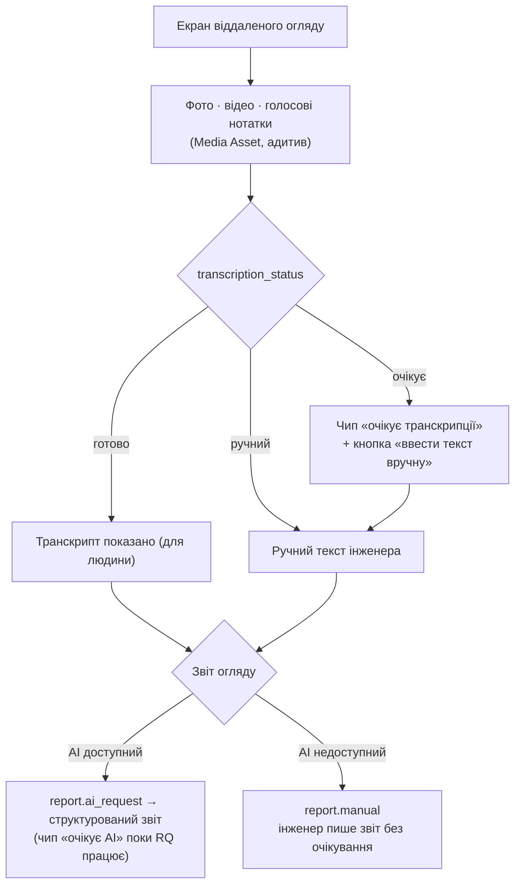

> Транскрипт **не йде авто в зовнішній AI** (резолюція ВП №3 Фази 2): він для інженера. Якщо потрібне AI-структурування — інженер витягує неперсональний Site Brief і запускає Builder (6.3).

### 6.5 Офлайн-виїзд + монтаж

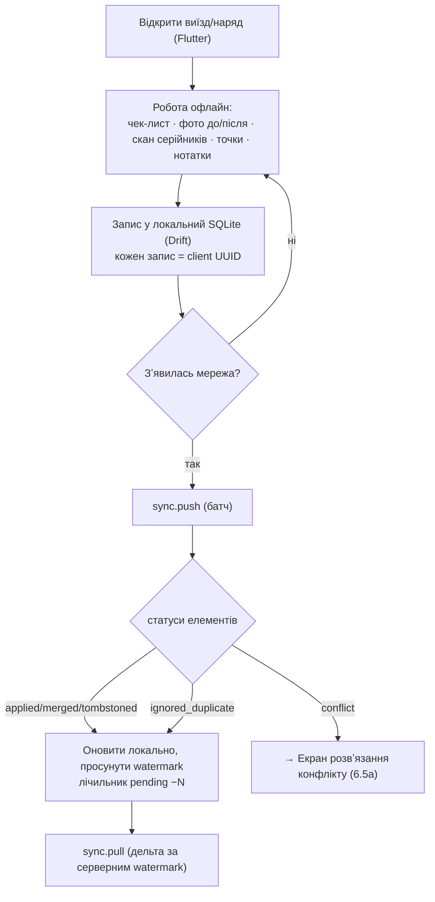

**6.5a — розвʼязання скалярного конфлікту:**

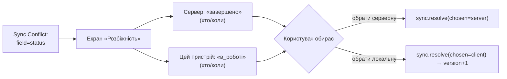

- **Адитивне (фото/відмітки/серійники/точки) ніколи не показує конфлікт** — union-merge тихо обʼєднує (двоє монтажників → сума, не втрата). Конфлікт-екран зʼявляється **лише для скалярів** (статус/нотатка).
- Часові мітки пристроїв у UI показуються **інформативно** («останній запис о…»), але **не використовуються** для автоматичного вибору — рішення завжди людини.

### 6.6 Карта монтажу — резолюція geolocation vs план-локальні x/y (ВП №2 Фази 2)

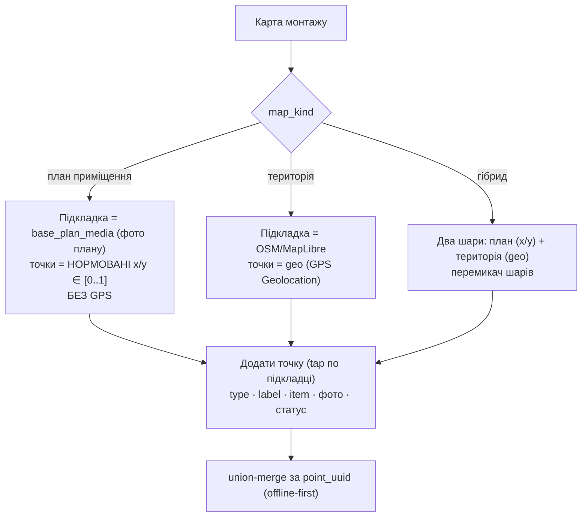

**Рішення (UX-рівень, у межах дата-моделі — Mount Point уже має і `geo`, і `x/y`):**
- **Внутрішні точки (план приміщення)** позиціонуються **нормованими x/y ∈ [0..1]** відносно завантаженого плану-підкладки (`base_plan_media`). Нормування (а не пікселі) робить точки стійкими до зміни роздільності/масштабу підкладки. GPS усередині будівлі ненадійний — тому **не використовується**.
- **Зовнішні точки (територія)** — `geo` (GPS) поверх OSM/MapLibre (основна карта, без білінгу — Фаза 1).
- **Гібрид** — два перемикані шари; кабельні маршрути (`Cable Route.path` як JSON-масив координат) рендеряться у системі координат свого шару.
- Координатна система точки визначається `map_kind` карти; змішування на одному шарі заборонено на рівні UX (валідація).

### 6.7 Кошторис: field-level маржа vs «список монтажу» монтажника

> **Уточнення формулювання задачі (не вирішую мовчки).** ТЗ-завдання згадує «кошторис із прихованою маржею для монтажника», але зафіксована RBAC-матриця Фази 2 каже: **монтажник не має доступу до `AI Estimate` взагалі** (—). Тут немає конфлікту — я **не** даю монтажнику доступ до кошторису. «Прихована маржа» інтерпретується як: операційний вид монтажника (що монтувати) **структурно не містить жодних цін**, а не «кошторис із заблюреними числами».

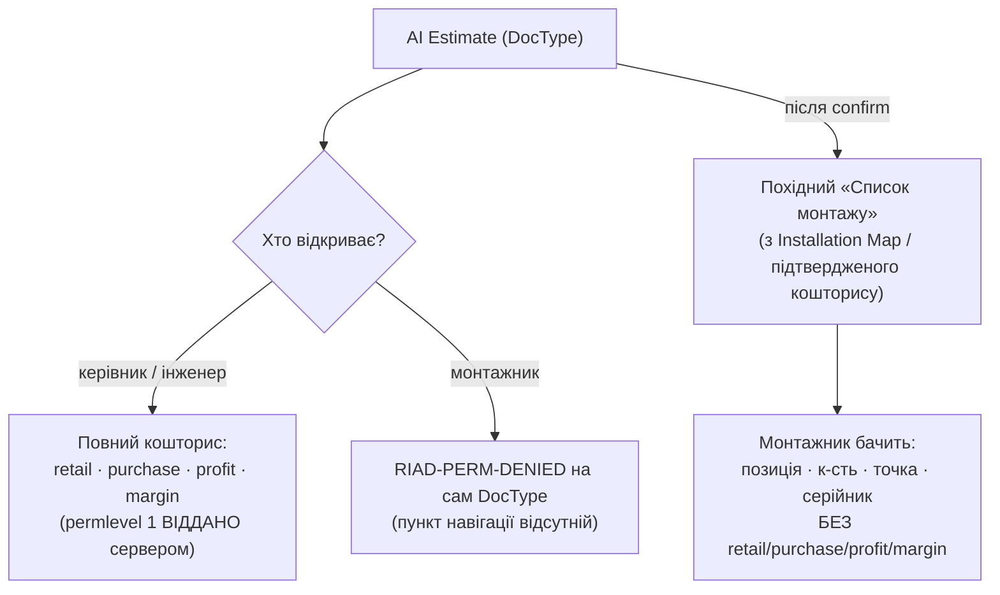

- На екрані кошторису колонки `purchase_rate / profit / margin_pct / total_cost / total_margin` рендеряться **лише якщо сервер їх повернув** (permlevel 1). Для ролі без рівня 1 цих колонок у DTO немає → їх немає в UI (не приховані CSS).
- Монтажник працює зі **«Списком монтажу»** — окремим операційним поданням (позиція + кількість + точка + серійник), де ціни **відсутні в джерелі даних**, а не сховані. Це другий рубіж поверх відсутності доступу до самого `AI Estimate`.

### 6.8 Vault — MFA step-up екран

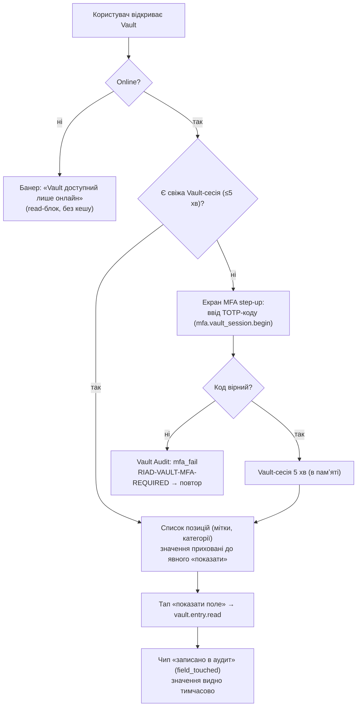

- **Окрема візуальна зона безпеки:** інша акцентна рамка/іконка замка, постійний індикатор «сесія Vault активна — Xс лишилось».
- Значення полів за замовчуванням **масковані**; кожен показ — окремий `read` → окремий запис аудиту. Користувач свідомий, що «перегляд = слід».
- Vault-сесія **ніколи не персиститься** на клієнті; при згортанні застосунку / TTL — знову MFA.
- На Flutter Vault — **online-only**, без локального SQLite-кешу (зафіксовано Фазою 1.5).

### 6.9 Акт передачі доступів

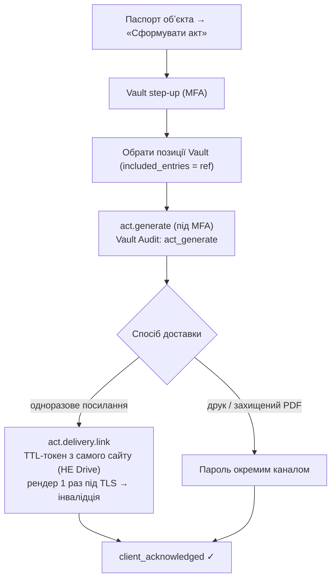

- На екрані явно: **«Дешифровані дані існують лише в момент доставки і не зберігаються»** — це не маркетинг, а видиме віддзеркалення інваріанта H6.
- Акт **ніколи не йде у Drive** і не email-вкладенням — UI не пропонує таких опцій взагалі.

### 6.10 Сервіс

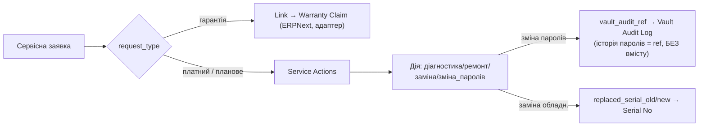

- Монтажнику видно операційні дії (без фінансів); «історія змін паролів» показується як **журнал подій-посилань** (хто/коли змінив), без жодного дешифрованого значення.

### 6.11 Калькулятор на сайті

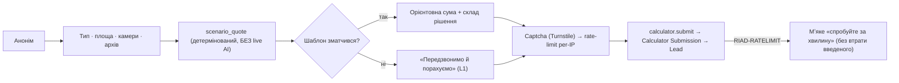

---

## 7. Каталог станів UI (відображення станів Фази 3)

Кожен стан Фази 3 має **один канонічний UI-патерн**, однаковий на всіх поверхнях.

### 7.1 AI-деградація (статус провайдера / origin кошторису)

| Стан (джерело) | UI-патерн | Поведінка |
|---|---|---|
| AI-основний доступний | **зелений чип** «AI: основний» у топбарі/home | повна функція |
| AI-резервний активний | **жовтий чип** «AI: резервний» | функція працює, інформуємо |
| `RIAD-AI-DEGRADED` (усі недоступні) | **сірий чип** «AI: ручний режим» + інлайн-банер на екрані Builder | кнопка «Згенерувати» → «Обрати сценарій»; **дії не блокуються** |
| `origin` готового кошторису | чип на самій чернетці (AI-основний/AI-резервний/ручний-сценарій) | прозорість походження для перевіряючого |

> AI-статус — **інформативний індикатор, ніколи не модалка**. Недоступність AI не перекриває екран.

### 7.2 Sync-стани

| Статус елемента push | UI |
|---|---|
| `applied` / `merged` / `tombstoned` | тихо застосовано, лічильник pending −1 |
| `ignored_duplicate` | тихо (ідемпотентність); жодного «помилка» |
| `conflict` | бейдж «розбіжність N» → екран вибору версії (6.5a) |
| pending (немає мережі) | індикатор хмари з лічильником у шапці |

### 7.3 Транскрипція / звіт огляду

| `transcription_status` / `inspection.status` | UI |
|---|---|
| `очікує` (транскрипції/AI) | **жовтий чип «очікує…»** + завжди доступна кнопка «ввести вручну» |
| `готово` | текст показано (для людини, не авто-в AI) |
| `ручний` | помітка «введено вручну» |

### 7.4 MFA-required

| Код | UI |
|---|---|
| `RIAD-VAULT-MFA-REQUIRED` | екран step-up TOTP (6.8); після успіху — повернення до дії; таймер сесії 5 хв видно |
| хибний код | інлайн-помилка «невірний код», запис `mfa_fail` (без розкриття деталей) |

### 7.5 Помилки, ліміти, права, мережа

| Код | HTTP | UI-патерн |
|---|---|---|
| `RIAD-AUTH-INVALID` | 401 | тихий refresh; якщо неможливо → екран логіну |
| `RIAD-AUTH-REFRESH-REUSE` | 401 | примусовий вихід + сповіщення «сесію відкликано з міркувань безпеки» |
| `RIAD-PERM-DENIED` | 403 | елемент/розділ **відсутній** у навігації (превентивно); якщо все ж стався — нейтральне «недоступно для вашої ролі» |
| `RIAD-VALIDATION` | 422 | **інлайн** під полями, без модалки; фокус на першому невалідному |
| `RIAD-RATELIMIT` | 429 | мʼякий банер «забагато спроб, зачекайте», введене зберігається |
| `RIAD-NOTFOUND` | 404 | «не знайдено або поза доступом» (не розкривати існування) |
| `RIAD-INTERNAL` | 500 | нейтральне «щось пішло не так», `request_id` для підтримки, без трас |
| Немає мережі | — | банер OFFLINE; read з кешу; write → черга синку |

> `SYNC-CONFLICT` і `AI-DEGRADED` — **бізнес-стани, не «червоні» помилки** (повертаються у `data`). UI показує їх як робочі стани (вибір/деградація), не як збій.

---

## 8. Field-level у UX (відображення Frappe-прав, не UI-only)

**Принцип (H7):** UI не приймає рішень про видимість. Він рендерить те, що **повернув сервер**. Поле відсутнє у DTO (через `permlevel`/row-perm) → елемента немає. Це другий рубіж поверх відсутності доступу до DocType.

Що бачить кожна роль на ключових екранах:

| Екран / поле | Керівник | Інженер | Монтажник | Склад |
|---|---|---|---|---|
| **AI Estimate** — `retail_rate` | ✓ | ✓ | ✗ (немає доступу до DocType) | ✗ |
| **AI Estimate** — `purchase_rate/profit/margin` (permlevel 1) | ✓ | ✓ (хто виставляє рахунок) | ✗ | ✗ |
| **Список монтажу** (похідний) — позиція/к-сть/точка | ✓ | ✓ | ✓ | ✓ (серійники) |
| **Список монтажу** — будь-яка ціна | ✓ | ✓ | **відсутня в джерелі** | ✗ |
| **Object Passport** — `internal_notes` | ✓ | ✓ | ✗ (лише операційне) | ✗ |
| **Calculator Submission** — `source_ip` (permlevel 1) | ✓ | ✓ | ✗ | ✗ |
| **Vault Entry** — `*_enc` значення | R під MFA | RW під MFA | лише позиції наряду, R під MFA online | ✗ |
| **Vault Audit Log** | R | R (власні) | ✗ | ✗ |
| **Аналітика/KPI/прибутковість** | ✓ | ✗ | ✗ | ✗ |
| **Карта монтажу — затвердження** | R | ✓ (затверджує) | ✗ (лише точки/статуси/фото) | ✗ |

**Навігаційний наслідок:** пункти меню рендеряться за фактичними ролями (claim `roles` — лише підказка для меню). Монтажник у PWA взагалі не отримує розділів «Кошториси / Аналітика / Vault-write / Акти». Це не «сірі» пункти — їх немає.

---

## 9. Офлайн-UX (Flutter)

### 9.1 Індикатори синку

- **Глобальний чип у шапці:** хмара зі станом — `синхронізовано` (✓) / `pending N` (стрілка вгору + лічильник) / `offline` (перекреслена хмара) / `конфлікти M` (трикутник).
- Тап по чипу → **екран «Синк»**: список локальних змін у черзі, останній успішний синк, кнопка «синхронізувати зараз», перелік конфліктів і помилок push.

### 9.2 Черга змін

- Кожен локальний запис = `client UUID` → у черзі видно «що чекає відправки» (виїзд, фото, серійник, точка).
- Ретрай **ідемпотентний**: повтор того ж UUID → `ignored_duplicate`, без дублів в UI.
- Помилка окремого елемента (напр. `RIAD-VALIDATION`) не блокує батч — елемент лишається в черзі з поміткою, решта йде.

### 9.3 Tombstones

- Видалення офлайн = **позначка видалення** (`riad_deleted`), не зникнення з історії синку. В UI видалений елемент зникає з робочого списку, але в черзі синку видно «видалення → відправити».
- Після pull tombstone з сервера → елемент зникає локально. «Воскресіння» неможливе (узгоджено з контрактом).

### 9.4 Поведінка без мережі

- **Працює офлайн:** виїзд, чек-лист, скан серійників, фото/відео, голосові нотатки (аудіо зберігається, транскрипція — пізніше), точки карти, нотатки.
- **Не працює офлайн (показує банер «потрібна мережа»):** Vault (online-only), AI Builder, створення Quotation, фінанси, генерація актів.
- Перехід online → авто-`push` черги → `pull` дельти; конфлікти спливають як робочий стан, не як збій.

---

## 10. UI-система та дизайн-напрям (резолюція ВП №5 Фази 1)

**Принципи, не піксельний дизайн.** Ціль — відчуття Monobank/Ajax: швидко, чисто, мінімум полів, dark-first.

### 10.1 Технологічний вибір (фіналізація)

| Поверхня | Рекомендація | Чому |
|---|---|---|
| **Next.js PWA** | **Tailwind CSS + shadcn/ui (Radix headless)** | повний контроль вигляду без важкого ERP-UI; доступні headless-примітиви; темізація через CSS-змінні (легко dark-first); узгоджено з «Tailwind+headless» Фази 1 |
| **Flutter** | **Material 3 з кастомною темою (dark-first)**, власні компоненти-обгортки | один кодбейс; M3 дає токени кольору/типографіки; кастомна тема прибирає «стоковий» вигляд |
| **Іконки** | один набір на всі поверхні (напр. Lucide для web, дзеркальний набір для Flutter) | візуальна єдність |

> shadcn/ui обрано замість Mantine: менше «готового» вигляду, більше контролю над Monobank-естетикою; компоненти копіюються в проєкт (не чорна скринька).

### 10.2 Дизайн-токени (напрям, фіналізація в дизайні)

- **Тема:** dark-first; світла — інверсія тих самих токенів. Перемикач + авто-за-системою.
- **Колір:** нейтральна темна база + **один акцент дії**; **семантичні статуси** — успіх/попередження/небезпека/інфо (саме вони несуть AI-статус, синк, конфлікт). Vault — **окремий «зона безпеки» акцент** (відрізняється від звичайного акценту дії).
- **Типографіка:** 1 родина, 3–4 розміри; великі зрозумілі цифри для сум (Monobank-відчуття).
- **Радіуси/тіні:** мʼякі скруглення, делікатні тіні; картки замість таблиць-стін.
- **Дотик:** мінімальна ціль 44–48px (польові рукавиці/мороз — реальний контекст монтажника).

### 10.3 Щільність і «мінімум полів»

- **Прогресивне розкриття** скрізь: обовʼязкове видно, решта — під «розширити».
- Списки — **картки з 2–3 ключовими фактами**, не рядки з 12 колонок.
- Один первинний CTA на екран; деструктивні дії — вторинні, з підтвердженням.
- Жодного екрана-форми ERPNext напряму (категорична заборона ТЗ) — навіть для no-code адмінок використовуємо спрощені обгортки над Frappe-формами.

---

## 11. Push-нотифікації (FCM) — UX (резолюція ВП №6 Фази 3)

Контракт уже є (`RIAD Device Session.push_token`). UX-рівень визначає **які події штовхати** (стримано, без шуму):

| Подія | Кому | Дія по тапу |
|---|---|---|
| Нова задача призначена (виїзд/монтаж/сервіс) | призначеному (монтажник/інженер) | відкрити картку задачі |
| Sync-конфлікт потребує рішення | власнику документа | екран вибору версії (6.5a) |
| Транскрипція готова | інженеру-ініціатору | відкрити нотатку/огляд |
| Кошторис готовий до перевірки | інженеру, що виставляє рахунок | екран перевірки (6.3) |
| Деградація: кошторис зібрано в ручному режимі | інженеру | відкрити чернетку (origin=ручний) |

**Принципи:** тихі дефолти (нічна тиша; групування); **Vault/секрети ніколи не в тілі push** (лише «потрібна ваша увага»); налаштування каналів у профілі. FCM-токен зберігається в `RIAD Device Session`, відкликається при logout/ревоку сесії.

---

## 12. Прийняті рішення Фази 4 (у межах конституції)

1. **Три навігаційні моделі:** Flutter — bottom-nav (4) + FAB швидких дій; PWA — бічна навігація за фактичними ролями; публічний сайт — лінійна воронка.
2. **Головний екран** = realtime «Мої задачі сьогодні» (socketio) з offline-fallback на кешований список + лічильник pending; швидкі дії за правами.
3. **Geolocation vs план-локальні x/y (ВП №2 Фази 2):** план приміщення → нормовані `x/y ∈ [0..1]` поверх `base_plan_media` (без GPS); територія → `geo` поверх OSM/MapLibre; гібрид → два шари. Координатна система за `map_kind`.
4. **Field-level у UX = рендер з відданого сервером** (H7): немає поля у DTO → немає елемента; навігація за фактичними ролями; «список монтажу» монтажника **не містить цін у джерелі**, а не приховує їх.
5. **AI-деградація — інформативний чип + інлайн-банер**, ніколи модалка/блок; кнопка «Згенерувати» → «Обрати сценарій»; origin кошторису показано на чернетці.
6. **Sync-конфлікт — екран вибору обох версій** лише для скалярів; адитивне обʼєднується тихо; device-час показується інформативно, не вирішує.
7. **Vault — окрема «зона безпеки»**: step-up MFA-екран, таймер сесії 5 хв, маскування значень, «записано в аудит» при кожному показі, online-only банер у Flutter.
8. **Акт передачі доступів** — UI явно декларує «дані лише на момент доставки»; опцій Drive/email-вкладення немає взагалі; доставка — TTL-посилання/друк/захищений PDF.
9. **UI-система (ВП №5 Фази 1):** Next.js → Tailwind + shadcn/ui (Radix); Flutter → Material 3 з кастомною dark-first темою. Дизайн-токени dark-first, окремий Vault-акцент.
10. **Push (ВП №6 Фази 3):** стриманий перелік подій; секрети ніколи в тілі push; токен у `RIAD Device Session`.
11. **Captcha публічного калькулятора:** рекомендовано **Cloudflare Turnstile** (мінімальна фрикція, приватність) на UX-рівні; конкретні пороги rate-limit — фаза безпеки.

---

## 13. Відкриті питання (передається далі)

1. **Гранулярність «свої обʼєкти» монтажника** (по `customer` / по призначенню на `Engineer Visit` / по полю команди) — впливає на фільтри списків «Мої обʼєкти/задачі» в обох клієнтах, але **залишається рішенням перед кодуванням API** (успадковано з Фази 2 §9.1 / Фази 3 §8.4). **Не вирішую мовчки** — UX готовий під будь-який із варіантів (список рендериться з того, що Frappe віддав).
2. **Конкретні пороги rate-limit** калькулятора/логіну та фінальний captcha-провайдер — фаза безпеки (UX-рекомендація: Turnstile).
3. **Формат/TTL одноразового посилання Акту** і політика повторної генерації — фаза безпеки (UX уже передбачає лише захищені канали).
4. **Винятковий офлайн-кеш Vault під наряд** (H4) — якщо бізнес підтвердить, потрібен окремий UX «викачати доступи під наряд» з видимим TTL/wipe; наразі UX = online-only банер.
5. **Деталі дизайну** (фінальна палітра, типографічна шкала, конкретні компоненти) — етап дизайну/прототипу, поза цією фазою (тут — лише напрям).

> Жодне з цих питань **не блокує** Фазу 5: екрани, флоу, стани й навігація визначені — є на що оцінювати складність і будувати план.

---

## 14. Що НЕ входить у Фазу 4 (передано далі)

- План розробки по етапах і оцінка складності кожного → **Фаза 5**.
- Ризики проєкту, варіанти масштабування, фінальний аудит концепції → **Фаза 6**.
- Реальна верстка, компоненти, прототип, фінальні дизайн-токени → етап дизайну/розробки після завершення проєктування.

---

## 15. Блок для DECISIONS.md (Фаза 4)

```
## Фаза 4 — UX-карта екранів — [дата]
### Прийняті рішення
- Три навігаційні моделі: Flutter = bottom-nav (Задачі/Обʼєкти/Vault/Синк) + FAB швидких дій;
  Next.js PWA = бічна навігація, що рендериться за ФАКТИЧНИМИ ролями (claim roles — лише підказка меню);
  публічний сайт = лінійна воронка калькулятора.
- Головний екран = realtime «Мої задачі сьогодні» (socketio+Redis) з offline-fallback на кешований
  список + лічильник pending; швидкі кнопки (лід/прорахунок/огляд/виїзд/сервіс) за правами.
- ВП №2 Фази 2 ЗАКРИТО (geolocation vs x/y): план приміщення → нормовані x/y ∈ [0..1] поверх
  base_plan_media (без GPS); територія → geo поверх OSM/MapLibre; гібрид → два шари; система
  координат точки визначається map_kind.
- Field-level у UX = рендер з відданого сервером (H7): немає поля в DTO → немає елемента в UI;
  «список монтажу» монтажника НЕ містить цін у джерелі даних (не приховування CSS); монтажник
  не має пунктів Кошториси/Аналітика/Vault-write/Акти в навігації.
- УТОЧНЕННЯ (не конфлікт): «кошторис із прихованою маржею для монтажника» з ТЗ-завдання
  реалізується як відсутність доступу монтажника до AI Estimate (RBAC Фази 2) + похідний
  ціно-вільний «Список монтажу»; permlevel 1 (purchase/profit/margin) — другий рубіж.
- AI-деградація = інформативний чип (зелений осн./жовтий рез./сірий ручний) + інлайн-банер,
  НІКОЛИ модалка чи блок дій; кнопка «Згенерувати» → «Обрати сценарій»; origin кошторису
  (AI-осн/AI-рез/ручний-сценарій) показано на чернетці. RIAD-AI-DEGRADED і RIAD-SYNC-CONFLICT —
  робочі бізнес-стани в UI, не «червоні» помилки.
- Sync-конфлікт = екран вибору ОБОХ версій лише для скалярів (sync.resolve, рішення людини);
  адитивне (фото/відмітки/серійники/точки) обʼєднується тихо (union-merge); час пристрою
  показується інформативно, але НЕ вирішує.
- Vault UX = окрема «зона безпеки»: step-up MFA-екран (TOTP), таймер сесії 5 хв, маскування
  значень, «записано в аудит» при кожному vault.entry.read; online-only банер у Flutter (без кешу).
- Акт передачі доступів = UI явно декларує «дані лише на момент доставки, не зберігаються»;
  опцій Drive/email-вкладення немає взагалі; доставка — TTL-посилання з сайту/друк/захищений PDF.
- UI-система ЗАКРИТО (ВП №5 Фази 1): Next.js → Tailwind + shadcn/ui (Radix headless);
  Flutter → Material 3 з кастомною dark-first темою. Дизайн-токени dark-first, один акцент дії
  + окремий Vault-акцент; великі цифри для сум; ціль дотику 44–48px; прогресивне розкриття,
  картки замість таблиць-стін; жодного прямого ERPNext-UI.
- Push (ВП №6 Фази 3): стриманий перелік подій (нова задача / sync-конфлікт / транскрипція готова /
  кошторис на перевірку / деградація в ручний режим); секрети НІКОЛИ в тілі push; токен у
  RIAD Device Session, відкликається при logout/ревоку.
- Каталог станів UI зафіксовано: AI-деградація, sync (applied/merged/conflict/tombstoned/
  ignored_duplicate), транскрипція/огляд (очікує/готово/ручний), MFA-required, та помилки
  (AUTH-INVALID→refresh/логін, REFRESH-REUSE→примусовий вихід, PERM-DENIED→відсутній пункт,
  VALIDATION→інлайн, RATELIMIT→мʼякий банер зі збереженням введеного, NOTFOUND, INTERNAL, offline).
- Captcha калькулятора: UX-рекомендація Cloudflare Turnstile (мінімальна фрикція); пороги — фаза безпеки.
### Відкриті питання
- Гранулярність «свої обʼєкти» монтажника (customer / призначення / команда) — рішення перед
  кодуванням API; UX готовий під будь-який варіант (списки рендеряться з відданого Frappe). НЕ вирішено мовчки.
- Конкретні пороги rate-limit (калькулятор/логін) + фінальний captcha-провайдер — фаза безпеки.
- Формат/TTL одноразового посилання Акту + політика повторної генерації — фаза безпеки.
- Винятковий офлайн-кеш Vault під наряд (H4) — якщо бізнес підтвердить, потрібен UX «викачати під
  наряд» з видимим TTL/wipe; наразі online-only.
- Фінальні дизайн-токени (палітра, типографічна шкала, конкретні компоненти) — етап дизайну/прототипу.
### Що це блокує / розблоковує
- РОЗБЛОКОВУЄ Фазу 5 (план + оцінка складності): визначені всі екрани, флоу, навігація, стани й
  UI-стек — є повний обсяг робіт для оцінки по поверхнях і модулях.
- РОЗБЛОКОВУЄ Фазу 6 (ризики): видимі UX-залежності (offline-конфлікти, Vault online-only,
  AI-деградація) для аналізу ризиків.
- НЕ блокує нічого: відкриті питання — тюнінг безпеки/дизайну, не архітектура.
```
