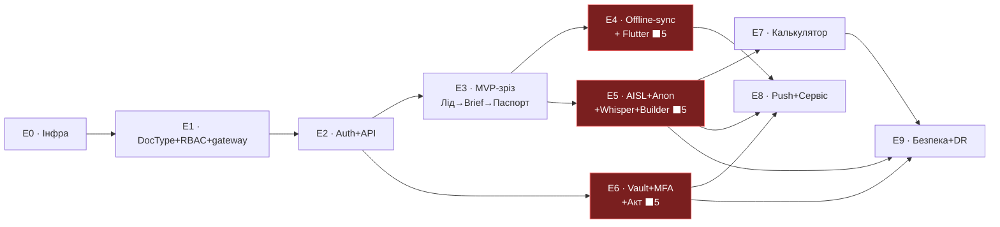

# RIAD Smart System — Фаза 5: План розробки по етапах + оцінка складності

> **Фаза:** 5 — План розробки
> **База:** `RIAD_Smart_System_TZ_v2.md`, `DECISIONS.md` (Фази 1, 1.5, 2, 3, 4), `01_architecture.md`, `015_architecture_audit.md`, `02_data_model.md`, `03_api_ai_architecture.md`, `04_ux_map.md`
> **Статус:** проєктування (код не пишемо — плануємо)
> **Дата:** _(проставити при збереженні)_

---

## 0. Межі фази та що вона фіксує

Ця фаза **не проєктує нову функціональність і не переглядає рішення Фаз 1–4**. Вона перетворює вже зафіксовані контракти (DocType, API, AISL, sync, Vault, UX) на **послідовність етапів розробки** з залежностями, критеріями готовності, оцінкою складності, критичним шляхом і керованим порядком ризикованих вузлів.

Вхідні фіксації, на яких будується план (не переглядаються):

- Один Frappe-сайт + RIAD custom app + in-process ORM; стандартні DocType ERPNext = джерело правди через антикорупційний gateway; **20 кастомних DocType**.
- API = whitelisted `riad.api.v1.*`; access JWT(15хв) + ротований refresh (reuse-detection) + Vault session(5хв); конверт `{ok,data|error}`; sync-протокол (UUID / серверна версія / union-merge / tombstones).
- AI: провайдер-агностичний шар, failover осн.→рез.→ручний(Scenario), Circuit Breaker у Redis, мінімізація-first + fail-closed + людський gate; Whisper self-hosted окремим контейнером.
- Vault: AES-256-GCM пополе, ключ поза БД, online-only, CI import-linter ізоляція від AI, hash-chain аудит, step-up MFA. Key-escrow (C2) — фаза безпеки.
- UX: три поверхні (Flutter offline-first / Next.js PWA / публічний калькулятор); Tailwind+shadcn / Material 3 dark-first; field-level через Frappe-права; push через FCM; координати точки за `map_kind`.

---

## 1. Принципи плану

1. **Етап = вертикальний зріз, а не шар.** Кожен етап доводить функцію через усі задіяні поверхні (backend + Flutter / Next.js / публічний сайт) до робочого стану, а не «спершу весь backend, потім весь фронт». Виняток — E0/E1/E2 (інфра-фундамент, який фізично передує будь-якому зрізу).
2. **Складність — відносна, не календарна.** Шкала **1–5** (1 = тривіально, 5 = найважчий вузол системи) + явні **драйвери складності**. Абсолютних строків не даємо (за завданням — відносна шкала); календар залежить від розміру команди (див. §8, відкрите питання).
3. **Найважчі вузли (за аудитом і ТЗ):** offline-sync (H3), Vault-крипто+ізоляція (C1/H6), AI-failover+Circuit Breaker (M9), антикорупційний адаптер (M3), анонімізація fail-closed (H1/H2). План навмисно ставить між ними дешевий MVP-зріз раніше, а важкі вузли — у керованому, ізольованому порядку.
4. **Безпекові рішення не вирішуються мовчки тут.** План лише **прив'язує, КОЛИ** відкриті питання безпеки (key-escrow C2, пороги rate-limit, офлайн-кеш Vault H4) мають бути закриті відносно етапів. Самі механізми — предмет фази безпеки.
5. **DoD = перевірюваний інваріант, не «зроблено».** Кожен етап має критерій готовності, сформульований як спостережувана поведінка контракту.

---

## 2. Карта етапів E0–E9

| Етап | Назва | Тип | Складність | Ризик строків |
|---|---|---|---|---|
| **E0** | Інфра-фундамент / DevOps базис | backend/infra | 3 | 🟡 середній |
| **E1** | Custom app + 20 DocType + RBAC + gateway (read) | backend | 4 | 🟠 високий |
| **E2** | Auth + API-каркас (envelope, коди, версіонування, CRUD) | backend | 4 | 🟠 високий |
| **E3** | MVP-зріз: Лід → Site Brief → Паспорт (online, без AI/Vault/offline) | вертикальний | 2 | 🟢 низький |
| **E4** | Offline-sync двигун + польовий Flutter | вертикальний | **5** | 🔴 критичний |
| **E5** | AISL + анонімізація + Whisper + AI Builder → ERPNext | вертикальний | **5** | 🔴 критичний |
| **E6** | Password Vault + MFA step-up + hash-chain аудит + Акт | вертикальний | **5** | 🔴 критичний |
| **E7** | Публічний сайт + калькулятор (захист периметра) | вертикальний | 3 | 🟡 середній |
| **E8** | Push (FCM) + realtime-поліш + завершення сервіс-флоу | вертикальний | 2 | 🟢 низький |
| **E9** | Гартування безпеки + DR + фінальна підготовка | backend/infra | 4 | 🟠 високий |

### 2.1 Граф залежностей і критичний шлях

**Спинний хребет (обов'язково послідовно):** `E0 → E1 → E2 → E3`. Це найкоротший шлях до робочого вертикального зрізу.
**Три важкі вузли** (E4, E5, E6) розгалужуються після спинного хребта і можуть іти **частково паралельно** (деталі — §5).

---

## 3. Етапи детально

Формат кожного: **Обсяг по поверхнях (backend / Next.js / Flutter / публічний сайт) · Передумови · DoD · Що розблоковує · Складність + драйвери.**

---

### E0 — Інфра-фундамент / DevOps базис

**Backend/infra.** Відтворюваний Docker Compose: Frappe/ERPNext v15 + MariaDB 10.6+ + Redis + Nginx/Traefik (TLS, Let's Encrypt). Два середовища **staging + production** з ручним підтвердженням деплою. Durability-каркас: MariaDB **binlog (PITR)**, **Redis AOF** для черги (M2), нічний `bench backup` + **шифровані бекапи** at-rest (M6). Каркас CI: лінт, місце під **import-linter gate** (наповнюється в E1/E6), прогін міграцій. Reverse proxy як єдина точка входу.

**Next.js / Flutter / публічний сайт.** Лише скелети репозиторіїв + CI-збірка (без екранів).

**Передумови.** Наявне розгортання ERPNext v15 (контекст ТЗ).

**DoD.** Staging і production підіймаються з Compose відтворювано; TLS працює; **drill «бекап→відновлення» проходить на staging** (включно з перевіркою цілісності); CI зелений на порожньому app. Whisper-контейнер описаний у Compose (ресурс-ліміти, concurrency=1, M4), але без інтеграції.

**Розблоковує.** Усі наступні етапи (нема де запускати код / нема CI-гейтів).

**Складність: 3.** Драйвери: відтворюваність Compose, TLS, drill відновлення, durability-налаштування (binlog/AOF), каркас CI-гейту.

---

### E1 — Custom app + 20 DocType + RBAC + антикорупційний gateway (read)

**Backend.** RIAD custom app. Усі **20 кастомних DocType** з полями/типами Frappe, Link/Dynamic Link на стандартні, child-таблицями; **sync-метадані** на syncable-DocType (`name`=client UUID, `riad_version`, `riad_deleted`+`riad_deleted_at`); **field-level `permlevel 1`** (purchase_rate/profit/margin/total_cost; source_ip). RBAC: RIAD-ролі = Frappe-ролі (керівник / інженер / монтажник / склад / RIAD Scenario Admin / RIAD AI Admin); **1 RIAD-користувач = 1 Frappe User з вимкненим desk** (L3). **Антикорупційний gateway** `riad.erpnext_gateway` — RIAD-DTO для **читання** стандартних DocType (Lead/Customer/Item/Serial No/Quotation/Stock/Accounts); **CI-лінт** на згадки ERPNext-DocType поза gateway (M3).

**Next.js / Flutter / публічний сайт.** Не задіяні (схема даних).

**Передумови.** E0.

**DoD.** Усі 20 DocType мігрують чисто; `permlevel 1` реально приховує поля через Frappe permission engine (перевірка двома ролями, H7); gateway читає стандартні DocType лише через DTO; **CI-лінт на пряму згадку ERPNext-DocType поза gateway — червоний при порушенні**; ролі засіяні.

**Розблоковує.** API-шар (E2) і кожну функцію, що торкається даних. Структурно готує місце під Vault DocType (E6) і AI-сутності (E5).

**Складність: 4.** Драйвери: **антикорупційний адаптер (M3)** — найважча частина; ширина 20 DocType; коректність field-level (H7); sync-метадані як фундамент під E4.

---

### E2 — Auth + API-каркас

**Backend.** Простір `riad.api.v1.*`; авто-REST `/api/resource` **назовні не експонується**. Middleware-ланцюг. Токени: **access JWT 15хв** + **ротований refresh** у `RIAD Device Session` з **reuse-detection** + каркас **Vault session** (наповнюється в E6). **Уніфікований конверт** `{ok,data|error{code,message,request_id}}`; канонічні коди; `PERM-DENIED`-мапінг Frappe `PermissionError`; `SYNC-CONFLICT`/`AI-DEGRADED` як бізнес-стани в `data`. **Версіонування** v1 + `X-RIAD-API-Version` + вікно депрекації. Узагальнений CRUD (`get/list/upsert/submit`) на online-DocType **в контексті Frappe User** (права/field-level ензфорсить рушій). `auth.*`, `mfa.enroll.*`, `infra.health`.

**Next.js / Flutter.** Технічний login-флоу (без бізнес-екранів) для перевірки контракту; secure-storage токенів (Flutter `flutter_secure_storage`).

**Передумови.** E1.

**DoD.** login/refresh/logout/sessions працюють; **повторний refresh → `RIAD-AUTH-REFRESH-REUSE` + примусовий вихід**; конверт і коди однакові на всіх методах; `PermissionError`→`RIAD-PERM-DENIED` без витоку трас; CRUD ензфорсить `permlevel 1`; версія у заголовку відповіді.

**Розблоковує.** Усі три поверхні (потрібні auth+CRUD); MVP-зріз E3; контракт, який споживають клієнти.

**Складність: 4.** Драйвери: безпека ротації refresh + reuse-detection; коректність межі **JWT↔Frappe-права (H7)**; централізований мапінг помилок; offline-чутливе версіонування (E4 від нього залежить).

---

### E3 — MVP-зріз: Лід → Site Brief → Паспорт (online, без AI/Vault/offline)

**Перший робочий вертикальний зріз.** Online-only, повністю ручний — доводить наскрізну зв'язку auth+дані+UI до демо ще ДО важких вузлів.

**Backend.** `crm.lead.create/convert`; `crm.site_brief.upsert/get` (неперсональні поля); `passport.upsert/get/list`; `passport.client_release.generate` (детермінований рендер **без Vault-полів**, ніколи у Drive).

**Next.js PWA.** Логін + MFA-enrollment; дашборд «Мої задачі» (realtime socketio); Ліди (список+картка); Створення/кваліфікація ліда (мінімум полів); **Site Brief-редактор** («це йде в AI» — неперсональні поля); Паспорт об'єкта (внутрішній); Клієнтська версія паспорта (реліз).

**Flutter.** Логін; «Мої задачі сьогодні» (online-варіант, offline-оболонка — в E4); Картка об'єкта (read).

**Публічний сайт.** Не задіяний (E7).

**Передумови.** E2.

**DoD.** Інженер у PWA створює лід → заповнює Site Brief → генерує внутрішній паспорт + клієнтський реліз (без Vault-полів); задача з'являється на home; Flutter логіниться і бачить задачі/картку об'єкта онлайн.

**Розблоковує.** Доводить наскрізну архітектуру; **Site Brief** — обов'язковий вхід для E5 (AI Builder); картка об'єкта — каркас, на який E4 вішає польову роботу.

**Складність: 2.** Драйвери: переважно CRUD+UI; жодного важкого вузла; realtime socketio — єдина нетривіальна частина.

---

### E4 — Offline-sync двигун + польовий Flutter 🔴

**Найважчий польовий вузол.** Реалізує sync-контракт Фази 3 і весь offline-сценарій Flutter.

**Backend.** `sync.push/pull`: `name`=UUID (ідемпотентність, M8), **серверна монотонна `riad_version`**, **union-merge адитивних колекцій** за `_uuid`, **field-level конфлікт скалярів → `Sync Conflict`** (обидві версії), **tombstones**, pull = дельта за **серверним watermark** (opaque token; годинник пристрою не бере участі). Offline-DocType: `Engineer Visit`, `Checklist Instance`(+items), `Media Asset`, `Installation Map`(+точки/маршрути). `media.register` (Drive ID); серійник-скан → `erpnext_gateway.record_serial_scan` (пише `Serial No` лише через адаптер). Інтеграція **Google Drive** (service account) для медіа.

**Flutter (основний обсяг).** Локальний **SQLite через Drift**; черга змін; індикатори синку (pending N); **екран розв'язання конфлікту** (обидві версії скаляра, вибір людини); Виїзд інженера; Чек-лист монтажу (відмітки = union-merge); Камера фото/відео (`ai_allowed=0` за замовч.; теги до/після/СММ); Скан серійника QR/штрихкод (дубль = `ignored_duplicate`); Карта монтажу — точки (x/y план vs GPS територія за `map_kind`); tombstones; поведінка без мережі.

**Next.js.** Карта монтажу — редактор + **затвердження (лише інженер)**; Склад: серійники/залишки через gateway.

**Публічний сайт.** Не задіяний.

**Передумови.** E2 (auth/API/версіонування), E1 (DocType+sync-метадані), E3 (картка об'єкта). Під-залежність: Google Drive.

**DoD.** Польовий інженер працює **повністю офлайн**; на реконекті адитивне зливається тихо, **скалярний конфлікт виходить на ручний вибір (без тихого перезапису)**; **повторний push ідемпотентний** (дублікати не створюються, M8); серійні скани потрапляють у ERPNext **лише через gateway**; годинник пристрою не впливає на вирішення.

**Розблоковує.** Повний польовий workflow; медіа для віддаленого огляду (E5); польову частину сервісу (E8).

**Складність: 5.** Драйвери: **offline-sync (H3)** — union-merge vs field-level семантика; UX конфлікту; **ідемпотентність (M8)**; Drift-сховище й черга; інтеграція Drive. Найбільша концентрація прихованої складності в системі.

---

### E5 — AISL + анонімізація + Whisper + AI Builder → ERPNext 🔴

**AI-вузол.** Реалізує AISL, ланцюг failover, анонімізацію і жорстку межу «AI-кошторис не входить у ERPNext без інженера».

**Backend.** Провайдер-агностичний адаптер `complete()`/`health_check()`; `AI Provider` DocType (no-code, ключі поза БД); **failover осн.→рез.→ручний(Scenario)**; **Circuit Breaker — спільний стан у Redis (M9)**; `AI Request Log` (**лише анонімізований payload**, M10). **Шар анонімізації**: мінімізація-first (вхід = `Site Brief`), NER (Presidio+spaCy) як defense-in-depth, **fail-closed**, **людський gate** перед відправкою; сирі фото не в AI (`ai_allowed=0`, H2). **Whisper** self-hosted (інтеграція контейнера з E0); **RQ-задачі**: `transcribe_media`, `ai_estimate_build`, `ai_retry`, `inspection_report_build`. Методи: `estimate.build(site_brief,variant)` / `get` / `review.submit` / **`confirm`** (жорстка межа: `status=підтверджено` + `reviewed_by` → `gateway.create_quotation`); `scenario.*` (no-code); `ai_admin.provider.*`/`request_log.list`; `inspection.report.ai_request/manual`; `media.transcription.request/manual`.

**Next.js PWA.** AI Project Builder (кошторис, origin AI-осн/AI-рез/ручний); **Людський gate «що піде в AI»** (показ точного payload + підтвердження); Перевірка й підтвердження кошторису (чернетка→на перевірці→підтверджено→Quotation); Варіанти (дешевий/оптимальний/преміум); AI-провайдери (no-code); AI Request Log; Сценарії (no-code); Чек-лист-шаблони (no-code); Віддалений огляд + стани транскрипції; **AI-деградація = чип+банер, не модалка**.

**Flutter.** Голосова нотатка → `transcription.request` (аудіо offline, транскрипція online); польова частина віддаленого огляду.

**Публічний сайт.** Не задіяний напряму, але `Scenario` тут стають готовими для детермінованого калькулятора E7.

**Передумови.** E3 (Site Brief — вхід AI), E1 (gateway — створення Quotation), E0 (Whisper-контейнер). Whisper-інтеграцію можна готувати паралельно з E4.

**DoD.** Кошторис будується ланцюгом осн.→рез.→ручний; **деградація показана як бізнес-стан, не «червона» помилка**; **жоден AI-кошторис не входить у ERPNext без `reviewed_by`**; анонімізація **fail-closed** (помилка → зовнішній виклик не робиться); `AI Request Log` містить **лише анонімізований payload**; Circuit Breaker спільний між воркерами (M9); Whisper concurrency=1 у лімітах (M4); сире фото не йде в зовнішній AI.

**Розблоковує.** Повний потік кошторис→Quotation; ручний Scenario-фолбек; **Сценарії для калькулятора E7**.

**Складність: 5.** Драйвери: **AI-failover + Circuit Breaker (M9)**; **анонімізація fail-closed + людський gate (H1/H2)**; оркестрація Whisper + RQ (M4); жорстка межа `confirm`→gateway.

---

### E6 — Password Vault + MFA step-up + hash-chain аудит + Акт 🔴

**Vault-крипто-вузол.** Реалізує ізольований Vault, MFA-потік і Акт передачі доступів. **Може йти паралельно з E4/E5** (залежить лише від E2/E1).

**Backend.** `Vault Entry` (**AES-256-GCM пополе**, `*_enc`=Long Text, **ключ поза БД** — docker secret / файл `0400`, **не env**); `Vault Access Enrollment` (TOTP-секрет, зашифрований); `Vault Audit Log` (**hash-chain** prev_hash/record_hash, append-only, **без update/delete-прав**, M5); `Access Transfer Act` (**on-demand під MFA**, дешифровані дані **лише в пам'яті** на доставку, не at-rest, **ніколи у Drive**, одноразове **TTL-посилання** з сайту). `mfa.vault_session.begin/status` (step-up TOTP, **5хв, Redis, web-worker only**); `vault.entry.read/upsert` (**MFA**, дешифрування лише в web-воркері, кожне поле → аудит); `vault.audit.list`; `act.generate/delivery.link/acknowledge`. **CI import-linter gate**: заборона взаємних імпортів Vault↔AISL/anon — це і робить ізоляцію code-level (C1); AI/RQ-воркери **без ключ-контексту**.

**Next.js PWA.** Vault (список+перегляд, **step-up MFA**, online-only, маскування, «записано в аудит»); Vault Audit (hash-chain, read-only); Акт передачі доступів (дані лише на доставку, TTL-посилання, без Drive/email); MFA-enrollment.

**Flutter.** Vault-перегляд позицій наряду **під MFA online-only** (банер «лише онлайн», «записано в аудит»); MFA-enrollment.

**Публічний сайт.** Не задіяний.

**Передумови.** E2 (auth/API/MFA-каркас), E1 (Vault DocType). Незалежний від E4/E5 — головний кандидат на паралель.

**DoD.** Шифрування пополе зовнішнім ключем; **import-linter CI доводить відсутність програмного шляху Vault→AI** (червоний при порушенні, C1); кожен read/write — у hash-chain аудит; **Акт генерується під MFA, без at-rest-секретів, ніколи у Drive, доставка TTL-посиланням**; польовий пристрій — online-only ензфорсно.

**Розблоковує.** Безпечну передачу облікових даних; завершує розділення «клієнтський паспорт ↔ Vault»; «історія паролів» сервісу як ref на Vault Audit (E8).

**Складність: 5.** Драйвери: **Vault-крипто + ізоляція code-level (C1)**; **hash-chain аудит (M5)**; **потік Акту (H6)**; step-up MFA; поводження з майстер-ключем.

---

### E7 — Публічний сайт + калькулятор (захист периметра)

**Backend.** `calculator.submit` (**анонім**, **rate-limit per-IP Redis token-bucket + captcha**) + `calculator.scenario_quote` (**детермінований, без live-AI**, H5); `Calculator Submission` → `Lead` (graceful-захоплення); `source_ip` `permlevel 1`.

**Публічний сайт (Next.js SSR/SSG).** Лінійна воронка: Параметри об'єкта (без PII) → Миттєва детермінована оцінка зі `Scenario` → Контакти (опц., **Turnstile captcha → rate-limit**, контакти **не йдуть в AI**) → Подяка/лід захоплено. Privacy-мікротекст (мінімізація видима клієнту).

**Next.js PWA / Flutter.** Не задіяні (ліди з'являються у вже готовому списку E3).

**Передумови.** E5 (`Scenario` для детермінованої оцінки), E2 (захоплення ліда). Captcha-провайдер + пороги — відкрите питання безпеки (§7).

**DoD.** Анонімна воронка дає детерміновану оцінку зі Scenario **без live зовнішнього AI**; captcha+rate-limit блокують абʼюз (H5); лід захоплюється навіть на rate-limit (мʼяке повідомлення); контакти ніколи не йдуть в AI.

**Розблоковує.** Публічний потік лідів.

**Складність: 3.** Драйвери: захист від абʼюзу (H5); решта легша — спирається на Scenario з E5.

---

### E8 — Push (FCM) + realtime-поліш + завершення сервіс-флоу

**Backend.** Push-події (нова задача / sync-конфлікт / транскрипція готова / кошторис на перевірку / деградація в ручний); **секрети НІКОЛИ в тілі push**; FCM-токен у `RIAD Device Session`, відкликається при logout/ревоку. Сервіс: `service.request.upsert/get`, `service.action.add` → Link на ERPNext `Warranty Claim`; «історія паролів» = ref на `Vault Audit Log` (без дешифрованого вмісту).

**Flutter / Next.js.** Обробка push; завершення сервіс-екранів (без фінансів для монтажника).

**Передумови.** E4 (sync-події), E5 (транскрипція/кошторис-події), E6 (ref на Vault Audit для історії паролів).

**DoD.** Стриманий перелік push доставляється, **без секретів у тілі**, токен має коректний життєвий цикл; сервісна заявка лінкується на Warranty Claim; історія паролів показує лише ref-аудит.

**Розблоковує.** Завершує польовий і сервісний UX.

**Складність: 2.** Драйвери: дисципліна вмісту push; інтеграція FCM.

---

### E9 — Гартування безпеки + DR + фінальна підготовка

**Backend/infra.** **Key-escrow (C2)**: процедура зберігання резерву майстер-ключа окремо від бекапу БД + ротація + **DR-runbook**. Шифровані бекапи + **restore-drills включно з відновленням Vault через escrow** (M6). Перевірка binlog PITR. Тюнінг ресурс-лімітів Whisper (M4) і **параметрів Circuit Breaker на staging**. Фіналізація **порогів rate-limit** (калькулятор/логін) і captcha-провайдера. Опційно: зовнішнє append-only сховище аудиту (друга лінія M5); **винятковий офлайн-кеш Vault (H4)** — лише якщо бізнес підтвердив (шифрований+TTL+wipe+аудит).

**Передумови.** E6 (Vault), E5 (AI), E7 (rate-limit).

**DoD.** Відкриті питання безпеки закриті (key-escrow, пороги rate-limit, рішення про офлайн-кеш Vault); **DR-drill проходить, включно з відновленням Vault**.

**Розблоковує.** Готовність до продакшн-релізу.

**Складність: 4.** Драйвери: key-escrow + DR; перевірюваність відновлення Vault; тюнінг під реальний трафік.

---

## 4. Зведена оцінка складності й драйвери найважчих вузлів

| Етап | Складність (1–5) | Головні драйвери | Вузол аудиту |
|---|---|---|---|
| E0 | 3 | Compose, TLS, durability (binlog/AOF), restore-drill | M1/M2/M6 |
| E1 | 4 | **антикорупційний адаптер**, ширина 20 DocType, field-level | **M3**, H7 |
| E2 | 4 | ротація refresh + reuse-detection, межа JWT↔Frappe | H7 |
| E3 | 2 | CRUD+UI, realtime socketio | — |
| **E4** | **5** | **offline-sync union/field-level**, ідемпотентність, Drift, Drive | **H3**, M8 |
| **E5** | **5** | **AI-failover+Circuit Breaker**, **анонімізація fail-closed+gate**, Whisper | **M9, H1/H2**, M4 |
| **E6** | **5** | **Vault-крипто+ізоляція code-level**, hash-chain, Акт, MFA | **C1, H6, M5** |
| E7 | 3 | захист від абʼюзу (rate-limit+captcha) | H5 |
| E8 | 2 | дисципліна push, FCM | — |
| E9 | 4 | key-escrow + DR, перевірка відновлення Vault | C2, M6 |

**П'ять найважчих вузлів системи** (концентрація ризику):
1. **Offline-sync (E4, H3)** — найбільше прихованої складності: семантика union-merge vs field-level конфлікт, ідемпотентність, серверний watermark, UX вибору версій без тихого перезапису.
2. **Vault-крипто + ізоляція code-level (E6, C1/H6)** — крипто пополе, доказова ізоляція через import-linter, hash-chain, потік Акту з даними лише в памʼяті.
3. **AI-failover + анонімізація (E5, M9/H1/H2)** — спільний Circuit Breaker, fail-closed анонімізація з людським gate, оркестрація Whisper.
4. **Антикорупційний адаптер (E1, M3)** — єдина точка доступу до ERPNext; помилка тут протікає у всі наступні етапи.
5. **Межа JWT↔Frappe-права (E2, H7)** — дві системи дозволів не повинні розсинхронізуватись; ензфорс лише Frappe-рушієм.

---

## 5. Критичний шлях, паралелізація, концентрація ризику

### 5.1 Критичний шлях

Найдовший ланцюг залежностей: **E0 → E1 → E2 → E3 → E5 → E7 → E9**.
Альтернативний довгий ланцюг через польовий клієнт: **E0 → E1 → E2 → E4 → E8**.
Оскільки E4, E5, E6 усі мають складність 5, **фактичну тривалість визначає найповільніший із трьох важких вузлів**, а не сам ланцюг залежностей.

### 5.2 Що можна паралелити

- **E6 (Vault) — головний кандидат на паралель:** залежить лише від E2/E1, не від E3/E4/E5. Його можна стартувати одразу після E2 і вести **повністю паралельно** з E3→E4→E5, прибравши з критичного шляху.
- **E4 і E5** обидва залежать від E3, але **між собою незалежні** (offline-sync і AI не перетинаються контрактно, крім медіа-asset, де E4 постачає Drive-ID, а E5 — транскрипцію того ж аудіо). За наявності розділених треків їх можна вести паралельно; за одного backend-розробника — послідовно (рекомендований порядок — §6).
- **Whisper-контейнер** (інтеграція для E5) готується паралельно ще на E0/E4.
- **no-code адмінки** (Scenario, Checklist Template, AI Provider) усередині E5 — слабко зчеплені, можна виносити в окремий під-трек.
- **Публічний сайт (E7)** залежить від E5 лише через `Scenario`; верстку воронки можна робити паралельно з E5, інтегруючи `scenario_quote` наприкінці.

### 5.3 Де ризик для строків найбільший

- 🔴 **E4** — найвищий ризик: семантика конфліктів і ідемпотентність легко дають тихі баги-втрати даних; UX вибору версій нетривіальний; Drift+Drive — дві зовнішні інтеграції.
- 🔴 **E5** — fail-closed анонімізація + людський gate + спільний Circuit Breaker мають багато крайових станів; укр. NER ненадійний (тому мінімізація-first критична).
- 🔴 **E6** — крипто й доказова ізоляція не пробачають помилок; key-escrow (C2) — зовнішня залежність від рішення бізнесу/безпеки.
- 🟠 **E1** — адаптер M3 є фундаментом; помилка протікає всюди далі.

**Стратегія зниження ризику:** важкі вузли ізольовані в окремі етапи з власним DoD-інваріантом; між E3 і ними стоїть дешевий робочий зріз; E6 виноситься на паралель, щоб не подовжувати критичний шлях.

---

## 6. MVP-кістяк і керований порядок важких вузлів

**MVP-кістяк (найраніший робочий вертикальний зріз):** **E0 + E1 + E2 + E3.**
Результат — демонстрована онлайн-зв'язка: вхід → лід → Site Brief → внутрішній + клієнтський паспорт → realtime «Мої задачі». Це доводить auth, дата-модель, gateway, API-конверт і UI-стек **до того, як починаються важкі вузли** — рання валідація архітектури за мінімальних вкладень.

**Керований порядок важких вузлів (рекомендований за обмеженого паралелізму):**
1. **E6 (Vault) — паралельно з самого старту після E2.** Не на критичному шляху, але найчутливіший до безпеки; ранній старт дає запас на крипто-помилки й рішення по key-escrow.
2. **E5 (AI) — перший із залежних від E3.** На критичному шляху до E7; розблоковує і кошторис, і калькулятор.
3. **E4 (offline) — після/паралельно E5.** Найскладніший, але не блокує E7; може йти своїм треком до E8.

Логіка: спершу дешевий доказ (E3), потім найчутливіший до безпеки вузол із запасом часу (E6), потім вузол на критичному шляху (E5), наприкінці найскладніший польовий (E4). E7→E8→E9 завершують периметр, інтеграцію й гартування.

---

## 7. Прив'язка етапів до відкритих питань безпеки

| Відкрите питання | Джерело | Коли має бути ЗАКРИТЕ відносно плану | Жорсткий гейт |
|---|---|---|---|
| **Key-escrow майстер-ключа (C2)** | Фаза 1.5, аудит | Проєктування — на старті **E6**; процедура + ротація + DR-runbook операціоналізуються в **E9** | **Жодних реальних Vault-секретів у production до наявності escrow-процедури** (гейт перед прод-релізом E6) |
| **Пороги rate-limit + captcha-провайдер** | Фаза 3/4 | Дефолт закладається в **E7**; фінальні пороги — на **E9** (підбір на staging) | Публічний калькулятор не виходить у production без діючого rate-limit (гейт E7) |
| **Винятковий офлайн-кеш Vault (H4)** | Фаза 1.5/2/4 | **Рішення бізнесу — до старту E6** (за замовчуванням online-only) | Якщо «так» — окремий **під-етап після E6/у E9** (шифрований+TTL+remote-wipe+аудит); якщо «ні» — нічого не кешується |
| Параметри Circuit Breaker | Фаза 3 | Дефолти в E5; тюнінг — **E9** (staging) | — |
| Зовнішнє append-only сховище аудиту (M5, друга лінія) | Фаза 2 | На старті чи відкладено — рішення у **E9** | — |
| Гранулярність «свої об'єкти» монтажника | Фаза 2/3/4 | **Перед кодуванням row-level у E4** (UX готовий під будь-який варіант) | Має бути зафіксована до фінального row-level в E4 |

---

## 8. Відкриті питання Фази 5

1. **Розмір і структура команди.** План дає **відносну складність і залежності**, але календар і реальна паралелізація (E6 ‖ E4/E5) залежать від кількості розробників (backend / Flutter / Next.js / DevOps). Контекст ТЗ — ФОП, тож імовірно мала команда з обмеженим паралелізмом; за одного backend-розробника E4/E5/E6 ідуть **послідовно** в порядку §6. Це **не змінює оцінок складності**, лише календар. → потрібне підтвердження для прив'язки до строків (Фаза 6 / планування ресурсів).
2. **Поріг «синхронно vs RQ» для `estimate.build`** (Фаза 3) — впливає на UX очікування в E5; підбір за латентністю на staging.
3. **Гранулярність row-level монтажника** — має бути вирішена до фінального row-level у E4 (див. §7).

> Жодне з цих питань **не блокує** старт за планом (E0–E3 не залежать від них). Вони уточнюються до відповідних етапів.

---

## 9. Що НЕ входить у Фазу 5 (передано далі)

- Кількісний аналіз ризиків, матриця ймовірність×вплив, план реагування, масштабування під зростання, фінальний аудит готовності → **Фаза 6**.
- Конкретні дизайн-токени, прототипи екранів → етап дизайну.
- Механізми безпеки (key-escrow, конкретні пороги) → фаза безпеки (прив'язку «коли» дано в §7).

---

## 10. Блок для DECISIONS.md (Фаза 5)

_(винесено окремо нижче у відповіді — вставити у `DECISIONS.md`)_
